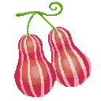

# Mane Mane no Mi

{ .mod-icon }

| | |
|---|---|
| **Type** | Paramecia |
| **Theme** | Imitation |
| **Box** | { .box-icon } Wooden |
| **Chance per opening** | wooden **2.21%** ([how it works](index.md#box-odds)) |
| **Abilities** | 2: 2 active, 0 passive |

Found in the base mod's **wooden Devil Fruit box**. Eat it and its abilities appear in the ability menu, grouped under the fruit.

!!! note "About the values"
    The values are those of the ability's tooltip in game, with the base mod's default settings. Damage is shown on the base mod's scale, as in the ability screen.

## Face Touch { #face-touch }

{ .ability-icon } *Active*

The user touches whoever they look at and remembers their look. The one touched is not hurt and is not told.

The ability mode key opens the memory

| Stat | Value |
|---|---|
| Cooldown | 2 s |
| Range | 4 blocks (line) |

## Mane Mane Memory { #mane-mane-memory }

*Active*

The user takes the look of someone they have touched, and keeps it until they use the ability again or receive a blow.

The ability mode key opens the memory, where the look is chosen

| Stat | Value |
|---|---|
| Cooldown | 5 s |
| Hold | ∞ s |
