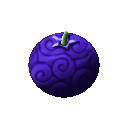

# Moa Moa no Mi

{ .mod-icon }

| | |
|---|---|
| **Type** | Paramecia |
| **Theme** | More |
| **Box** | { .box-icon } Iron |
| **Chance per opening** | iron **1.71%**, wooden **0.085%** ([how it works](index.md#box-odds)) |
| **Abilities** | 7: 7 active, 0 passive |

Found in the base mod's **iron Devil Fruit box**. Eat it and its abilities appear in the ability menu, grouped under the fruit.

!!! note "About the values"
    The values are those of the ability's tooltip in game, with the base mod's default settings. Damage is shown on the base mod's scale, as in the ability screen.

## Jubai Sandan { #jubai-sandan }

{ .ability-icon } *Active*

The user blows on specks of dust and enlarges them ten times, firing 8 pebbles in a cone where they are looking

| Stat | Value |
|---|---|
| Damage type | Projectile |
| Haki | Imbuing |
| Cooldown | 8 s |
| Damage | 4 |

## Gojubai Ho { #gojubai-ho }

{ .ability-icon } *Active*

The user throws a handful of small things and enlarges them fifty times, firing 5 cannonballs that burst where they land

| Stat | Value |
|---|---|
| Damage type | Projectile |
| Haki | Imbuing |
| Cooldown | 14 s |
| Damage | 8 |
| Burst Damage | 5 |

## Hyakubai Gan { #hyakubai-gan }

{ .ability-icon } *Active*

The next projectile fired by the user is enlarged a hundred times in flight and bursts where it lands

| Stat | Value |
|---|---|
| Damage type | Projectile |
| Haki | Imbuing |
| Cooldown | 20 s |
| Hold | 10 s |
| Damage | 26 |

## Hyakubai Giri { #hyakubai-giri }

{ .ability-icon } *Active*

The user throws the weapon they are holding and enlarges it a hundred times, cutting every enemy on its way

| Stat | Value |
|---|---|
| Damage type | Slash, Projectile |
| Haki | Imbuing |
| Cooldown | 16 s |
| Damage | 22 |

## Jubai Soku { #moa-soku }

{ .ability-icon } *Active*

The user multiplies their own speed ten, thirty or a hundred times, the faster they go the shorter it lasts. The speed is chosen before with the alternate mode

Jubai Soku

Sanjubai Soku

Hyakubai Soku

| Stat | Value |
|---|---|
| Cooldown | 20 s |
| Movement Speed | +80 % |
| Attack Speed | +20 % |
| Duration | 30 s |
| Movement Speed | +160 % |
| Attack Speed | +40 % |
| Duration | 15 s |
| Movement Speed | +300 % |
| Attack Speed | +80 % |
| Duration | 5 s |

## Hyakubai Soku: Renda { #hyakubai-soku-renda }

{ .ability-icon } *Active*

The user rushes at a hundred times their speed to the enemy they are looking at and hits everyone in front of them with a barrage of 12 punches

| Stat | Value |
|---|---|
| Damage type | Fist, Physical |
| Haki | Hardening |
| Cooldown | 18 s |
| Damage | 2.5 |

## Gojubai Soku: Gekitsui { #gojubai-soku-gekitsui }

{ .ability-icon } *Active*

The user rushes to the enemy they are looking at, grabs them and at fifty times their speed swings them around before slamming them into the ground

| Stat | Value |
|---|---|
| Damage type | Fist, Physical |
| Haki | Hardening |
| Cooldown | 20 s |
| Damage | 26 |
