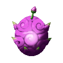
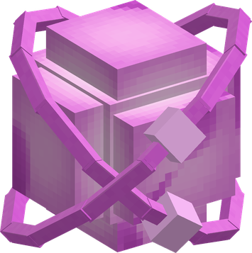

# Modo Modo no Mi

{ .mod-icon }

| | |
|---|---|
| **Type** | Paramecia |
| **Theme** | Return |
| **Box** | { .box-icon } Iron |
| **Chance per opening** | iron **1.71%**, wooden **0.085%** ([how it works](index.md#box-odds)) |
| **Abilities** | 6: 6 active, 0 passive |
| **Transformations** | [Own Youth](#own-youth) |
| **Effects applied** | { .effect-mini }[Younger](../effects.md#effect-younger) |

In 3D: drag to turn, scroll or pinch to zoom.

Found in the base mod's **iron Devil Fruit box**. Eat it and its abilities appear in the ability menu, grouped under the fruit.

!!! note "About the values"
    The values are those of the ability's tooltip in game, with the base mod's default settings. Damage is shown on the base mod's scale, as in the ability screen.

## Modo Modo { #modo-modo }

{ .ability-icon } *Active*

Applies { .effect-mini }[Younger](../effects.md#effect-younger)

The user touches the enemy in front of them and sends them twelve years back, they become smaller and weaker for a minute, and more so with each touch

After 5 touches a creature disappears and drops nothing. Players and bosses only get weaker

| Stat | Value |
|---|---|
| Cooldown | 3 s |
| Range | 3.5 blocks (line) |

## Modo Modo Shot { #modo-modo-shot }

{ .ability-icon } *Active*

{ .form-picture }

Applies { .effect-mini }[Younger](../effects.md#effect-younger)

The user throws a ball of pink energy, the first enemy it hits is sent twelve years back like with a touch

| Stat | Value |
|---|---|
| Cooldown | 7 s |

## Back to Lava { #back-to-lava }

{ .ability-icon } *Active*

The user turns the stone they are looking at and the stone around it back into lava. The lava stays

| Stat | Value |
|---|---|
| Cooldown | 20 s |
| Range | 10 blocks (line) |

## Entomb { #entomb }

{ .ability-icon } *Active*

The lava or soft ground under the feet of the enemy the user is looking at hardens back into rock and holds them. It lasts less on players and bosses

| Stat | Value |
|---|---|
| Cooldown | 20 s |
| Hold | 3–6 s |
| Range | 12 blocks (line) |

## Own Youth { #own-youth }

{ .ability-icon } *Active · Transformation*

The user sends their own body back in time, they become small and quick but their blows are weaker

## Renew { #renew }

{ .ability-icon } *Active*

The user repairs the damaged item they are holding

| Stat | Value |
|---|---|
| Cooldown | 300 s |
