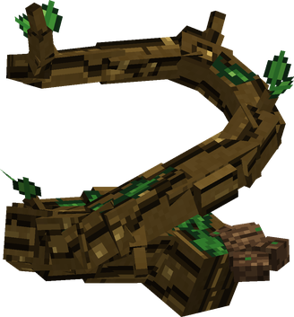
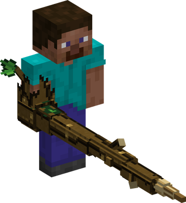
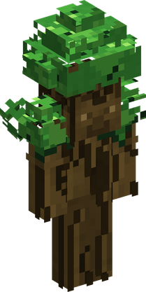
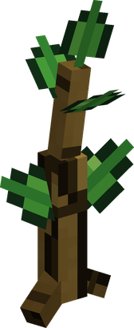
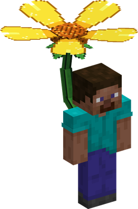

# Mori Mori no Mi

{ .mod-icon }

| | |
|---|---|
| **Type** | Logia |
| **Theme** | Forest |
| **Box** | { .box-icon } Golden |
| **Chance per opening** | golden **3.06%**, iron **0.153%**, wooden **0.008%** ([how it works](index.md#box-odds)) |
| **Abilities** | 10: 5 active, 5 passive |
| **Transformations** | [Kinniku Mori Mori](#kinniku-mori-mori) |

In 3D: drag to turn, scroll or pinch to zoom.

Found in the base mod's **golden Devil Fruit box**. Eat it and its abilities appear in the ability menu, grouped under the fruit.

!!! note "About the values"
    The values are those of the ability's tooltip in game, with the base mod's default settings. Damage is shown on the base mod's scale, as in the ability screen.

## Logia Invulnerability Mori { #logia-invulnerability-mori }

{ .ability-icon } *Passive*

Allows the user to avoid attacks by instinctively transforming parts of their body into their specific element

The user's body is made of living wood, fire always hurts them and deals 50% more damage.

## Kogosei { #kogosei }

{ .ability-icon } *Passive*

During the day and under the sky, the user does not get hungry and slowly regenerates health. Does not work during rain, night or under a roof

## Ryokuka { #ryokuka }

{ .ability-icon } *Passive*

The ground becomes green where the user walks, dirt turns into grass and plants and flowers grows on grass.

## Jukon { #jukon }

{ .ability-icon } *Active*

{ .form-picture }

Roots comes out of the ground where the user is looking at and grabs up to 6 enemies, they are stuck in place but can still attack.

Use the ability again for Kyusui, the roots drains the enemies every second, healing the user and weakening them

| Stat | Value |
|---|---|
| Damage type | Blunt, Indirect |
| Haki | Special |
| Cooldown | 20 s |
| Hold | 5 s |
| Damage | 14 |
| Range | 5 blocks (area) |

## Edayari { #edayari }

{ .ability-icon } *Active*

{ .form-picture }

The user's arm extends into a long branch that pierces all enemies in a line, they are stuck in place but can still attack

Use the ability again for Kyusui, the branch drains the enemies every second, healing the user and weakening them.

| Stat | Value |
|---|---|
| Damage type | Physical |
| Haki | Hardening |
| Cooldown | 8 s |
| Hold | 3 s |
| Damage | 20 |
| Range | 12 blocks (line) |

## Kinniku Mori Mori { #kinniku-mori-mori }

{ .ability-icon } *Active · Transformation*

{ .form-picture }

While standing on natural ground, the user transforms into a tree golem, increasing the damage and the range of their punches and their armor but making them slower. The other abilities are also stronger and bigger while in this form.

The size can be changed before using it, the giant golem lasts less and has a longer cooldown

Kinniku Mori Mori

Giant Kinniku Mori Mori

| Stat | Value |
|---|---|
| Cooldown | 6–30 s |
| Hold | 60 s |
| Size | x3 |
| Fist Damage | +10 |
| Armor | +6 |
| Other Abilities | x1.5 |
| Cooldown | 18–90 s |
| Hold | 30 s |
| Size | x8 |
| Fist Damage | +22 |
| Armor | +12 |
| Other Abilities | x3 |

## Wakagi { #wakagi }

{ .ability-icon } *Passive*

{ .form-picture }

If the user would die while in the golem form, the golem falls instead and the user grows back from a sapling a few blocks away with a part of their health. Does not work if killed by fire.

| Stat | Value |
|---|---|
| Cooldown | 300 s |

## Bokarin { #bokarin }

{ .ability-icon } *Active*

The user fills their wood with water so fire doesn't deal extra damage to them anymore, except for very strong fire attacks. The user moves and attacks slower while active

| Stat | Value |
|---|---|
| Cooldown | 5 s |

**Stats while active**

| Stat | Value |
|---|---|
| Attack Speed | x0.8 |
| Speed | x0.8 |

## Hanaguruma { #hanaguruma }

{ .ability-icon } *Active*

{ .form-picture }

A giant flower grows on the user's back and spins like a propeller allowing them to fly. Fire burns the flower and stops the flight. Can't be used in the golem form.

## Hisho { #hisho }

{ .ability-icon } *Passive*

While the flower is spinning the user can fly, until they have no more stamina
