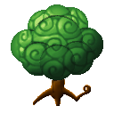

# Mori Mori no Mi

{ .mod-icon }

| | |
|---|---|
| **Type** | Logia |
| **Theme** | Forest |
| **Box** | { .box-icon } Golden |
| **Chance per opening** | golden **3.96%**, iron **0.198%**, wooden **0.010%** ([how it works](index.md#box-odds)) |
| **Abilities** | 10: 5 active, 5 passive |
| **Transformations** | [Kinniku Mori Mori](#kinniku-mori-mori) |

Found in the base mod's **golden Devil Fruit box**. Eat it and its abilities appear in the ability menu, grouped under the fruit.

!!! note "About the values"
    The values are those of the ability's tooltip in game, with the base mod's default settings. Damage is shown on the base mod's scale, as in the ability screen.

## Logia Invulnerability Mori { #logia-invulnerability-mori }

{ .ability-icon } *Passive*

Allows the user to avoid attacks by instinctively transforming parts of their body into their specific element

A body of living wood: fire always burns it, and half again as hard.

## Kogosei { #kogosei }

{ .ability-icon } *Passive*

In daylight under the open sky, the user no longer grows hungry and slowly heals. Rain, a roof or the night stop it.

## Ryokuka { #ryokuka }

{ .ability-icon } *Passive*

The ground turns green under the user's steps: dirt grows grass, and grass grows plants and flowers.

## Jukon { #jukon }

{ .ability-icon } *Active*

Roots burst out of the ground where the user aims and seize up to six enemies: held where they stand, they can still strike.

Used again while they are held, Kyusui: the roots drink them every second, heal the user and leave them weak.

| Stat | Value |
|---|---|
| Damage type | Blunt, Indirect |
| Cooldown | 20 s |
| Hold | 5 s |
| Damage | 8 |
| Range | 5 blocks (area) |

## Edayari { #edayari }

{ .ability-icon } *Active*

The user's arm shoots out as a long branch and runs through every enemy in a line: they stay impaled where they stand, still free to strike.

Used again while they are impaled, Kyusui: the branch drinks them every second, heals the user and leaves them weak.

| Stat | Value |
|---|---|
| Damage type | Physical |
| Haki | Hardening |
| Cooldown | 8 s |
| Hold | 3 s |
| Damage | 20 |
| Range | 12 blocks (line) |

## Kinniku Mori Mori { #kinniku-mori-mori }

{ .ability-icon } *Active · Transformation*

Standing on natural ground, the user becomes a tree golem: stronger fists with a longer reach, armored and hard to push back, but slower. While a golem, his other techniques strike harder, farther and bigger.

Its size is chosen beforehand: the giant golem lasts a shorter time, on a longer cooldown.

Kinniku Mori Mori

Giant Kinniku Mori Mori

| Stat | Value |
|---|---|
| Cooldown | 6–30 s |
| Hold | 60 s |
| Size | x3 |
| Fist Damage | +10 |
| Armor | +6 |
| Other Techniques | x1.5 |
| Cooldown | 18–90 s |
| Hold | 30 s |
| Size | x8 |
| Fist Damage | +22 |
| Armor | +12 |
| Other Techniques | x3 |

## Wakagi { #wakagi }

{ .ability-icon } *Passive*

When a blow would kill the user as a tree golem, the golem falls instead and he grows back from a sapling a few blocks away, with part of his health. Fire kills for good.

| Stat | Value |
|---|---|
| Cooldown | 300 s |

## Bokarin { #bokarin }

{ .ability-icon } *Active*

The user's wood fills with water and no longer fears fire, except a blow of fire strong enough to burn it all the same. Heavy with water, he walks and strikes slower. Until toggled off.

| Stat | Value |
|---|---|
| Cooldown | 5 s |

**Stats while active**

| Stat | Value |
|---|---|
| Speed | x0.8 |
| Attack Speed | x0.8 |

## Hanaguruma { #hanaguruma }

{ .ability-icon } *Active*

A giant flower grows out of the user's back and spins like a propeller: he flies while it turns. Fire burns it and stops the flight. Not as a tree golem.

## Hisho { #hisho }

{ .ability-icon } *Passive*

While the flower spins on the user's back, he flies, until his stamina runs out.
