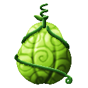
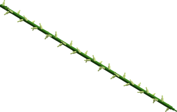
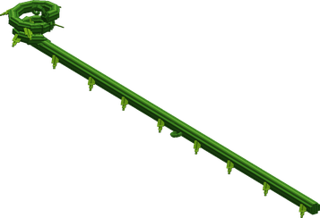
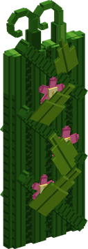
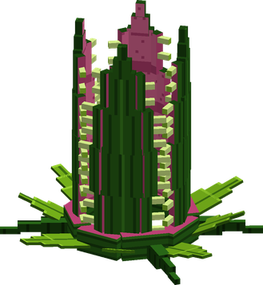

# Mosa Mosa no Mi

{ .mod-icon }

| | |
|---|---|
| **Type** | Paramecia |
| **Theme** | Growth |
| **Box** | { .box-icon } Wooden |
| **Chance per opening** | wooden **2.21%** ([how it works](index.md#box-odds)) |
| **Abilities** | 8: 7 active, 1 passive |
| **Effects applied** | { .effect-mini }[Buried](../effects.md#effect-buried) |

In 3D: drag to turn, scroll or pinch to zoom.

Found in the base mod's **wooden Devil Fruit box**. Eat it and its abilities appear in the ability menu, grouped under the fruit.

!!! note "About the values"
    The values are those of the ability's tooltip in game, with the base mod's default settings. Damage is shown on the base mod's scale, as in the ability screen.

## Greenery { #greenery }

{ .ability-icon } *Passive*

Shows the plants the user can use, the plants they carry are shown in green when there are enough plants around them to use the abilities for free

## Mosa Mosa Dance { #mosa-mosa-dance }

{ .ability-icon } *Active*

The user dances, making the plants around them grow and covering the grass with tall grass and flowers

| Stat | Value |
|---|---|
| Cooldown | 15 s |
| Range | 9 blocks (area) |

## Thorn Whip { #thorn-whip }

{ .ability-icon } *Active*

{ .form-picture }

The user lashes a thorny vine where they are looking, damaging all the enemies on its way

| Stat | Value |
|---|---|
| Damage type | Slash |
| Haki | Imbuing |
| Cooldown | 6 s |
| Damage | 10 |
| Range | 12 blocks (line) |

## Vine Grip { #vine-grip }

{ .ability-icon } *Active*

{ .form-picture }

A vine shoots out of the closest plant and wraps around the enemy the user is looking at, they are stuck in place but can still attack.

Use the ability again to release the enemy

| Stat | Value |
|---|---|
| Damage type | Blunt, Indirect |
| Haki | Special |
| Cooldown | 14 s |
| Hold | 5 s |
| Damage | 8 |
| Range | 18 blocks (line) |

## Green Wall { #green-wall }

{ .ability-icon } *Active*

{ .form-picture }

The plants in front of the user rise into a wall that stops enemies and projectiles for a while

| Stat | Value |
|---|---|
| Cooldown | 20 s |
| Wall Lasts | 8 s |

## Devouring Plant { #devouring-plant }

{ .ability-icon } *Active*

{ .form-picture }

Applies { .effect-mini }[Buried](../effects.md#effect-buried)

Plants rise around the enemy the user is looking at and swallow them, they can't move, attack or use abilities and are damaged every second.

Use the ability again to release the enemy

| Stat | Value |
|---|---|
| Damage type | Blunt, Indirect |
| Haki | Special |
| Cooldown | 18 s |
| Hold | 3 s |
| Damage | 6–15 |
| Range | 16 blocks (line) |

## Root Bridge { #root-bridge }

{ .ability-icon } *Active*

Roots grow in front of the user into a bridge that lasts for a while, it goes up or down when the user is looking up or down

| Stat | Value |
|---|---|
| Cooldown | 12 s |
| Range | 20 blocks (line) |

## Mosa Mosa Kuzushi { #mosa-mosa-kuzushi }

{ .ability-icon } *Active*

The user dances wildly, big plants rise next to all the enemies around them and slam them

| Stat | Value |
|---|---|
| Damage type | Blunt, Indirect |
| Haki | Special |
| Cooldown | 30 s |
| Damage | 16 |
| Range | 12 blocks (area) |
