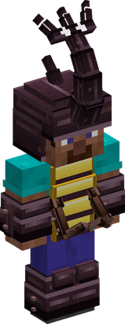
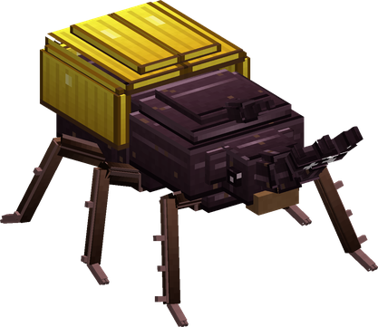

# Mushi Mushi no Mi, Model: Kabutomushi

{ .mod-icon }

| | |
|---|---|
| **Type** | Zoan |
| **Box** | { .box-icon } Iron |
| **Chance per opening** | iron **2.45%**, wooden **0.122%** ([how it works](index.md#box-odds)) |
| **Abilities** | 6: 4 active, 2 passive |
| **Transformations** | [Kabutomushi Heavy Point](#kabutomushi-heavy-point), [Kabutomushi Walk Point](#kabutomushi-walk-point) |

In 3D: drag to turn, scroll or pinch to zoom.

Found in the base mod's **iron Devil Fruit box**. Eat it and its abilities appear in the ability menu, grouped under the fruit.

!!! note "About the values"
    The values are those of the ability's tooltip in game, with the base mod's default settings. Damage is shown on the base mod's scale, as in the ability screen.

## Kabutomushi Heavy Point { #kabutomushi-heavy-point }

{ .ability-icon } *Active · Transformation*

{ .form-picture }

Transforms the user into a rhinoceros beetle hybrid, with a horn, a hard shell, 4 arms and wings to fly.

## Kabutomushi Walk Point { #kabutomushi-walk-point }

{ .ability-icon } *Active · Transformation*

{ .form-picture }

Transforms the user into a big rhinoceros beetle, which has a lot of armor, can fly and can carry another player

## Kabutomushi Flight { #kabutomushi-flight }

*Passive*

Requires Kabutomushi Heavy Point or Kabutomushi Walk Point to be active.

## Kabutomushi Rideable { #kabutomushi-rideable }

{ .ability-icon } *Passive*

Allows another player to ride on the beetle's back.

Requires Kabutomushi Walk Point to be active.

## Beetle Upper { #beetle-upper }

{ .ability-icon } *Active*

While in the hybrid form, the user dashes forward while spinning and headbutts all enemies in their path, launching them into the air

| Stat | Value |
|---|---|
| Damage type | Blunt, Physical |
| Cooldown | 11 s |
| Damage | 10 |

## Horn Toss { #horn-toss }

{ .ability-icon } *Active*

The user picks up the enemy in front of them with their horn and throws it over their back.

| Stat | Value |
|---|---|
| Damage type | Blunt |
| Cooldown | 7 s |
| Damage | 6 |
