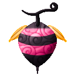

# Mushi Mushi no Mi, Model: Suzumebachi

{ .mod-icon }

| | |
|---|---|
| **Type** | Zoan |
| **Box** | { .box-icon } Iron |
| **Chance per opening** | iron **2.45%**, wooden **0.122%** ([how it works](index.md#box-odds)) |
| **Abilities** | 5: 4 active, 1 passive |
| **Transformations** | [Suzumebachi Heavy Point](#suzumebachi-heavy-point), [Suzumebachi Walk Point](#suzumebachi-walk-point) |

Found in the base mod's **iron Devil Fruit box**. Eat it and its abilities appear in the ability menu, grouped under the fruit.

!!! note "About the values"
    The values are those of the ability's tooltip in game, with the base mod's default settings. Damage is shown on the base mod's scale, as in the ability screen.

## Suzumebachi Heavy Point { #suzumebachi-heavy-point }

{ .ability-icon } *Active · Transformation*

Transforms the user into a giant hornet hybrid: four arms that strike fast, wings to fly and a venomous stinger.

## Suzumebachi Walk Point { #suzumebachi-walk-point }

{ .ability-icon } *Active · Transformation*

Transforms the user into a great giant hornet: light, fast in the air, with a venomous stinger.

## Suzumebachi Flight { #suzumebachi-flight }

*Passive*

Requires Suzumebachi Heavy Point or Suzumebachi Walk Point to be active.

## Stinger { #stinger }

{ .ability-icon } *Active*

The hornet's stinger stabs the enemy in front and poisons it with a strong venom.

| Stat | Value |
|---|---|
| Damage type | Physical |
| Cooldown | 6 s |
| Damage | 7 |

## Pink Hornets { #pink-hornets }

{ .ability-icon } *Active*

Calls a swarm of pink hornets that attack the enemy the user looks at, or whoever fights her, and poison it.

| Stat | Value |
|---|---|
| Cooldown | 30 s |
| Hold | 15 s |
| Damage | 2 |
