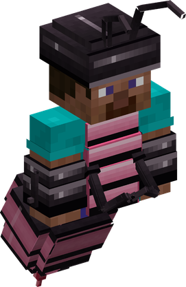
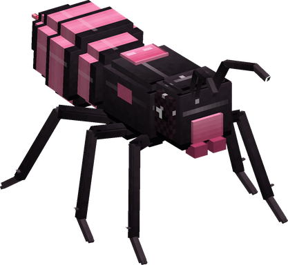
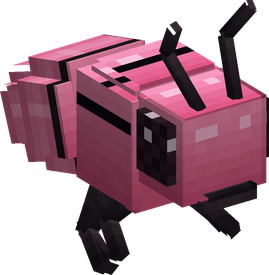

# Mushi Mushi no Mi, Model: Suzumebachi

{ .mod-icon }

| | |
|---|---|
| **Type** | Zoan |
| **Box** | { .box-icon } Iron |
| **Chance per opening** | iron **1.71%**, wooden **0.085%** ([how it works](index.md#box-odds)) |
| **Abilities** | 9: 8 active, 1 passive (1 hidden, not in the ability menu) |
| **Transformations** | [Suzumebachi Heavy Point](#suzumebachi-heavy-point), [Suzumebachi Walk Point](#suzumebachi-walk-point) |

In 3D: drag to turn, scroll or pinch to zoom.

Found in the base mod's **iron Devil Fruit box**. Eat it and its abilities appear in the ability menu, grouped under the fruit.

!!! note "About the values"
    The values are those of the ability's tooltip in game, with the base mod's default settings. Damage is shown on the base mod's scale, as in the ability screen.

## Suzumebachi Heavy Point { #suzumebachi-heavy-point }

{ .ability-icon } *Active · Transformation*

{ .form-picture }

Transforms the user into a giant hornet hybrid, with 4 arms that attacks fast, wings to fly and a poisonous stinger

## Suzumebachi Walk Point { #suzumebachi-walk-point }

{ .ability-icon } *Active · Transformation*

{ .form-picture }

Transforms the user into a giant hornet, which is light, fast in the air and has a poisonous stinger.

## Suzumebachi Flight { #suzumebachi-flight }

*Passive*

!!! info "Hidden ability"
    It does not appear in the ability menu.

Requires Suzumebachi Heavy Point or Suzumebachi Walk Point to be active.

## Stinger { #stinger }

{ .ability-icon } *Active*

The user stabs the enemy in front of them with their stinger, applying a strong poison

| Stat | Value |
|---|---|
| Damage type | Physical |
| Haki | Hardening |
| Cooldown | 6 s |
| Damage | 7 |

## Pink Hornets { #pink-hornets }

{ .ability-icon } *Active*

{ .form-picture }

Summons a swarm of pink hornets that attacks the enemy the user is looking at, or the one attacking the user, and poisons it.

| Stat | Value |
|---|---|
| Cooldown | 30 s |
| Hold | 15 s |
| Damage | 2 |

## Needle Dash { #needle-dash }

{ .ability-icon } *Active*

The user dashes very fast where they are looking with their stinger, damaging and poisoning all enemies in their path

| Stat | Value |
|---|---|
| Damage type | Physical |
| Haki | Hardening |
| Cooldown | 10 s |
| Damage | 14 |

## Venom Spray { #venom-spray }

{ .ability-icon } *Active*

The user sprays their venom at the eyes of all enemies in front of them, blinding them, slowing them and poisoning them

| Stat | Value |
|---|---|
| Damage type | Internal |
| Haki | Special |
| Cooldown | 15 s |
| Damage | 5 |
| Range | 7 blocks (line) |

## Numbing Sting { #numbing-sting }

{ .ability-icon } *Active*

The user stabs the enemy in front of them with their stinger, the venom paralyses it for a few seconds

| Stat | Value |
|---|---|
| Damage type | Physical |
| Haki | Hardening |
| Cooldown | 18 s |
| Damage | 9 |

## Mandible Bite { #mandible-bite }

{ .ability-icon } *Active*

While in the hybrid form, the user bites the enemy in front of them with their mandibles, dealing heavy damage

| Stat | Value |
|---|---|
| Damage type | Physical |
| Haki | Hardening |
| Cooldown | 14 s |
| Damage | 22 |
