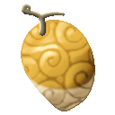
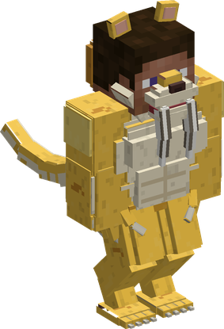
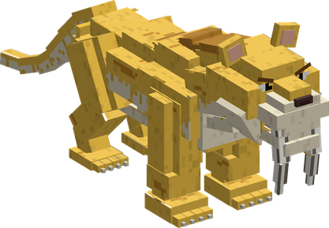

# Neko Neko no Mi, Model: Saber Tiger

{ .mod-icon }

| | |
|---|---|
| **Type** | Ancient Zoan |
| **Box** | { .box-icon } Iron |
| **Chance per opening** | iron **1.71%**, wooden **0.085%** ([how it works](index.md#box-odds)) |
| **Abilities** | 11: 11 active, 0 passive |
| **Transformations** | [Saber Tiger Heavy Point](#saber-tiger-heavy-point), [Saber Tiger Walk Point](#saber-tiger-walk-point) |

In 3D: drag to turn, scroll or pinch to zoom.

Found in the base mod's **iron Devil Fruit box**. Eat it and its abilities appear in the ability menu, grouped under the fruit.

!!! note "About the values"
    The values are those of the ability's tooltip in game, with the base mod's default settings. Damage is shown on the base mod's scale, as in the ability screen.

## Saber Tiger Heavy Point { #saber-tiger-heavy-point }

{ .ability-icon } *Active · Transformation*

{ .form-picture }

Transforms the user into a saber tiger hybrid, which is very fast and agile and has long fangs and sharp claws.

## Saber Tiger Walk Point { #saber-tiger-walk-point }

{ .ability-icon } *Active · Transformation*

{ .form-picture }

Transforms the user into a saber tiger, a very fast big cat that hunts by surprise with its long fangs.

## Saber Bite { #saber-bite }

{ .ability-icon } *Active*

The user bites the enemy in front of them with their long fangs, which go through part of its armor and make it bleed. Deals more damage while crouching or from behind

| Stat | Value |
|---|---|
| Damage type | Physical |
| Haki | Hardening |
| Cooldown | 10 s |
| Damage | 16–24 |
| Range | 2.5–3 blocks (line) |
| Pierces | Armour |

## Pounce { #pounce }

{ .ability-icon } *Active*

While in the full saber tiger form, the user leaps where they are looking and throws the first enemy they meet to the ground, where it can't move for a moment. Deals more damage if the user was crouching or hits from behind

| Stat | Value |
|---|---|
| Damage type | Physical |
| Haki | Hardening |
| Cooldown | 11 s |
| Damage | 14–21 |

## Throat Hold { #throat-hold }

{ .ability-icon } *Active*

While in the full saber tiger form, after a Pounce, the user holds the enemy they threw down under their fangs, it can't move and takes damage that goes through part of its armor. Use the ability again to let it go

| Stat | Value |
|---|---|
| Damage type | Physical |
| Haki | Hardening |
| Cooldown | 15 s |
| Hold | 3 s |
| Damage | 4 |
| Pierces | Armour |

## Claw Rake { #claw-rake }

{ .ability-icon } *Active*

The user slashes all the enemies in front of them with their claws, making them bleed and pushing them back

| Stat | Value |
|---|---|
| Damage type | Physical |
| Haki | Hardening |
| Cooldown | 8 s |
| Damage | 10 |
| Range | 2.5 blocks (line) |

## Roar { #roar }

{ .ability-icon } *Active*

The user roars, pushing back and weakening all nearby enemies

| Stat | Value |
|---|---|
| Cooldown | 18 s |
| Range | 7 blocks (area) |

## Evasive Leap { #evasive-leap }

{ .ability-icon } *Active*

The user leaps backwards and can't be hit during the jump

| Stat | Value |
|---|---|
| Cooldown | 7 s |
| Hold | 1 s |

## Gagan { #gagan }

{ .ability-icon } *Active*

While in the saber tiger hybrid form, the user shoots a blast of air shaped like their fangs from their mouth at the enemy they are looking at, it goes through part of its armor

| Stat | Value |
|---|---|
| Damage type | Indirect |
| Element | Wind |
| Haki | Imbuing |
| Cooldown | 10 s |
| Damage | 14 |
| Range | 16 blocks (line) |
| Pierces | Armour |

## Tekkai: Kibasen { #tekkai-kibasen }

{ .ability-icon } *Active*

While in the saber tiger hybrid form, the user hardens their body and fangs and leaps face first where they are looking, the first enemy they meet is hit through part of its armor and sent back. The user takes less damage during the leap

| Stat | Value |
|---|---|
| Damage type | Physical |
| Haki | Hardening |
| Cooldown | 13 s |
| Damage | 20 |
| Pierces | Armour |

## Shigan: Madara { #shigan-madara }

{ .ability-icon } *Active*

While in the saber tiger hybrid form, the user stabs the enemies in front of them many times very fast with the claws of both index fingers, making them bleed

| Stat | Value |
|---|---|
| Damage type | Physical |
| Haki | Hardening |
| Cooldown | 11 s |
| Damage | 2.5–20 |
| Range | 2.5 blocks (line) |
