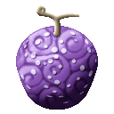
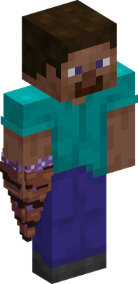
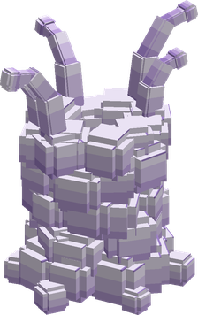
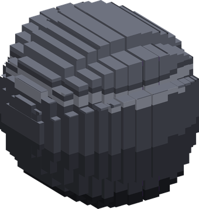

# Noko Noko no Mi

{ .mod-icon }

| | |
|---|---|
| **Type** | Paramecia |
| **Theme** | Mushroom |
| **Box** | { .box-icon } Iron |
| **Chance per opening** | iron **1.71%**, wooden **0.085%** ([how it works](index.md#box-odds)) |
| **Abilities** | 7: 7 active, 0 passive |
| **Effects applied** | { .effect-mini }[Spores](../effects.md#effect-spores) |

In 3D: drag to turn, scroll or pinch to zoom.

Found in the base mod's **iron Devil Fruit box**. Eat it and its abilities appear in the ability menu, grouped under the fruit.

!!! note "About the values"
    The values are those of the ability's tooltip in game, with the base mod's default settings. Damage is shown on the base mod's scale, as in the ability screen.

## Spin Drill { #spin-drill }

{ .ability-icon } *Active*

{ .form-picture }

Applies { .effect-mini }[Spores](../effects.md#effect-spores)

The user's hand becomes a drill that pierces the enemy in front of them and fills the wound with poisonous spores

| Stat | Value |
|---|---|
| Damage type | Fist, Physical |
| Haki | Hardening |
| Cooldown | 7 s |
| Damage | 12 |

## Shade Dance { #shade-dance }

{ .ability-icon } *Active*

Applies { .effect-mini }[Spores](../effects.md#effect-spores)

The user fires 10 bullets of spores where they are looking, each one poisons the enemy it hits

| Stat | Value |
|---|---|
| Damage type | Projectile |
| Haki | Imbuing |
| Cooldown | 8 s |
| Damage | 1.5 |

## Cross Shade { #cross-shade }

{ .ability-icon } *Active*

Applies { .effect-mini }[Spores](../effects.md#effect-spores)

The user fires 5 streams of spores at once in front of them, each bullet poisons the enemy it hits

| Stat | Value |
|---|---|
| Damage type | Projectile |
| Haki | Imbuing |
| Cooldown | 12 s |
| Damage | 1.5 |

## Lot Stiffen { #lot-stiffen }

{ .ability-icon } *Active*

The user creates 6 copies of themselves made of spores that attract the enemies around. A destroyed copy leaves a small cloud of spores

| Stat | Value |
|---|---|
| Damage type | Indirect |
| Cooldown | 25 s |

## Run Hypha { #run-hypha }

{ .ability-icon } *Active*

{ .form-picture }

Applies { .effect-mini }[Spores](../effects.md#effect-spores)

[Spores](../effects.md#effect-spores) run through the ground to the enemy the user is looking at and grow into fungi around them, they are stuck in place and poisoned

Use the ability again to release the enemy

| Stat | Value |
|---|---|
| Damage type | Indirect |
| Cooldown | 16 s |
| Hold | 6 s |
| Range | 16 blocks (line) |

## Snow Spore { #snow-spore }

{ .ability-icon } *Active*

The user releases a cloud of spores in front of them, everyone inside is poisoned and paralyzed for a moment. Fire burns the cloud away

| Stat | Value |
|---|---|
| Damage type | Indirect |
| Cooldown | 25 s |
| Range | 6 blocks (area) |

## Fatal Bomb { #fatal-bomb }

{ .ability-icon } *Active*

{ .form-picture }

The user fires a sphere full of spores that bursts into a huge deadly cloud, everyone inside but the user is heavily poisoned and paralyzed for a moment. Fire burns the cloud away

| Stat | Value |
|---|---|
| Damage type | Projectile |
| Haki | Imbuing |
| Cooldown | 180 s |
| Damage | 10 |
| Range | 14 blocks (area) |
