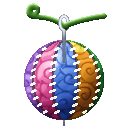
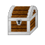
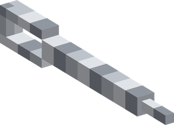

# Nui Nui no Mi

{ .mod-icon }

| | |
|---|---|
| **Type** | Paramecia |
| **Theme** | Stitch |
| **Box** | { .box-icon } Wooden |
| **Chance per opening** | wooden **2.92%** ([how it works](index.md#box-odds)) |
| **Abilities** | 7: 7 active, 0 passive |

In 3D: drag to turn, scroll or pinch to zoom.

Found in the base mod's **wooden Devil Fruit box**. Eat it and its abilities appear in the ability menu, grouped under the fruit.

!!! note "About the values"
    The values are those of the ability's tooltip in game, with the base mod's default settings. Damage is shown on the base mod's scale, as in the ability screen.

## Nuitsuke { #nuitsuke }

{ .ability-icon } *Active*

{ .form-picture }

Throws a needle with a thread, the target is sewn to the ground and can't move

| Stat | Value |
|---|---|
| Cooldown | 10 s |
| Hold | 6 s |

## Nuiawase { #nuiawase }

{ .ability-icon } *Active*

Throws a needle with a thread, the target is sewn to the closest other enemy and they can't get away from each other.

| Stat | Value |
|---|---|
| Cooldown | 12 s |
| Hold | 6 s |

## Haute Couture: Patchwork { #haute-couture-patchwork }

{ .ability-icon } *Active*

Sews all the enemies and items around the target to it and then pulls the thread, making them all crash into the target

| Stat | Value |
|---|---|
| Damage type | Blunt, Indirect |
| Cooldown | 18 s |
| Damage | 4–20 |
| Range | 8 blocks (area) |

## Tsukuroi { #tsukuroi }

{ .ability-icon } *Active*

Sews a wound of a nearby ally or of the user, which stops the bleeding and regenerates health for a while.

| Stat | Value |
|---|---|
| Cooldown | 20 s |

## Hodoki { #hodoki }

{ .ability-icon } *Active*

Removes all the stitches made by the user

| Stat | Value |
|---|---|
| Cooldown | 1 s |

## Ude Nui { #ude-nui }

{ .ability-icon } *Active*

Sews the arms of the enemy the user is looking at to its body, for 4 seconds it can't punch or shoot arrows but can still move and use abilities

| Stat | Value |
|---|---|
| Damage type | Slash, Indirect |
| Cooldown | 15 s |
| Damage | 5 |
| Hold | 4 s |

## Nui Tobi { #nui-tobi }

{ .ability-icon } *Active*

Throws a needle with a thread at the block the user is looking at and sews the user to it, the thread then pulls them to the block

| Stat | Value |
|---|---|
| Cooldown | 8 s |
| Range | 24 blocks (line) |
