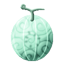

# Nuke Nuke no Mi

{ .mod-icon }

| | |
|---|---|
| **Type** | Paramecia |
| **Theme** | Passing through |
| **Box** | { .box-icon } Wooden |
| **Chance per opening** | wooden **2.21%** ([how it works](index.md#box-odds)) |
| **Abilities** | 5: 5 active, 0 passive |
| **Effects applied** | { .effect-mini }[Taken Along](../effects.md#effect-taken-along), { .effect-mini }[Untouched](../effects.md#effect-untouched) |

Found in the base mod's **wooden Devil Fruit box**. Eat it and its abilities appear in the ability menu, grouped under the fruit.

!!! note "About the values"
    The values are those of the ability's tooltip in game, with the base mod's default settings. Damage is shown on the base mod's scale, as in the ability screen.

## Pass Through { #pass-through }

{ .ability-icon } *Active*

The user walks through walls and floors. Crouching sinks into the ground and jumping rises through a ceiling

The user cannot pass through water. If it ends inside a block, the user is pushed to the nearest free place

| Stat | Value |
|---|---|
| Cooldown | 5–10 s |
| Hold | 5 s |

## Through Illusion { #through-illusion }

{ .ability-icon } *Active*

The user dives into the ground and comes up behind the enemy looked at, striking it with whatever is held

| Stat | Value |
|---|---|
| Damage type | Fist, Physical |
| Haki | Imbuing |
| Cooldown | 8 s |
| Damage | 6 |
| Range | 12 blocks (line) |

## Bottomless Hell { #bottomless-hell }

{ .ability-icon } *Active*

The ground under the enemy looked at lets everything through, a deep pit opens for a moment then closes and throws out whoever fell in

The blocks come back to their place. Where blocks cannot be changed, the enemies are held in the ground instead

| Stat | Value |
|---|---|
| Damage type | Indirect |
| Haki | Special |
| Cooldown | 20 s |
| Damage | 8 |
| Range | 12 blocks (line) |
| Range | 2.3 blocks (area) |

## Take Along { #take-along }

{ .ability-icon } *Active*

Applies { .effect-mini }[Taken Along](../effects.md#effect-taken-along)

The user takes the ally looked at along, held at the user's side the ally passes through blocks with the user

A player must be crouching to be taken along, and is released by crouching again. When released, the ally is put in the nearest free place

| Stat | Value |
|---|---|
| Cooldown | 12 s |
| Hold | 10 s |
| Range | 4 blocks (line) |

## Untouched { #untouched }

{ .ability-icon } *Active*

Applies { .effect-mini }[Untouched](../effects.md#effect-untouched)

For a moment, arrows, bullets and thrown weapons pass through the user without harming him

| Stat | Value |
|---|---|
| Cooldown | 15 s |
| Hold | 3 s |
