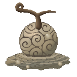
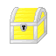
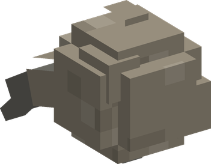
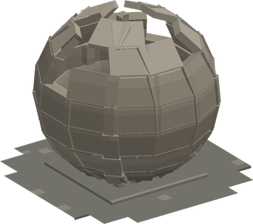
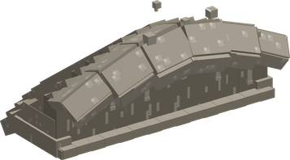
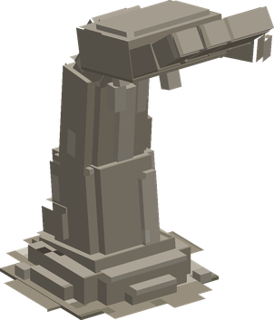

# Numa Numa no Mi

{ .mod-icon }

| | |
|---|---|
| **Type** | Logia |
| **Theme** | Swamp |
| **Box** | { .box-icon } Golden |
| **Chance per opening** | golden **3.96%**, iron **0.198%**, wooden **0.010%** ([how it works](index.md#box-odds)) |
| **Abilities** | 11: 10 active, 1 passive |
| **Effects applied** | [In the Swamp](../effects.md#effect-in-the-swamp) |

In 3D: drag to turn, scroll or pinch to zoom.

Found in the base mod's **golden Devil Fruit box**. Eat it and its abilities appear in the ability menu, grouped under the fruit.

!!! note "About the values"
    The values are those of the ability's tooltip in game, with the base mod's default settings. Damage is shown on the base mod's scale, as in the ability screen.

## Logia Invulnerability Numa { #logia-invulnerability-numa }

{ .ability-icon } *Passive*

Allows the user to avoid attacks by instinctively transforming parts of their body into their specific element

Arrows and thrown items that hits the user's swamp body are absorbed and stored inside it.

## Numa Numa no Gatling Gun { #numa-numa-no-gatling-gun }

{ .ability-icon } *Active*

{ .form-picture }

Shoots a burst of the things stored inside the swamp, first the arrows and then mud balls

| Stat | Value |
|---|---|
| Damage type | Blunt, Projectile |
| Damage | 3 |

## Numachi { #numachi }

{ .ability-icon } *Active*

Turns the ground around the user into a swamp for a while, everyone else sinks in it and is slowed.

| Stat | Value |
|---|---|
| Cooldown | 20 s |
| Hold | 15 s |
| Range | 6 blocks (area) |

## Numa Kyu { #numa-kyu }

{ .ability-icon } *Active*

{ .form-picture }

Traps the enemy the user is looking at inside a sphere of mud, which holds it, blinds it and suffocates it

| Stat | Value |
|---|---|
| Damage type | Blunt, Indirect |
| Cooldown | 15 s |
| Damage | 9 |
| Hold | 3 s |

## Hikizuri Komi { #hikizuri-komi }

{ .ability-icon } *Active*

Applies [In the Swamp](../effects.md#effect-in-the-swamp)

Pulls a nearby enemy inside the user's swamp body, where it is held and suffocates, and then spits it out. The range is bigger if the enemy is standing in the swamp.

| Stat | Value |
|---|---|
| Damage type | Blunt, Indirect |
| Cooldown | 18 s |
| Damage | 14 |
| Hold | 5 s |

## Numa Sensui { #numa-sensui }

{ .ability-icon } *Active*

Applies [In the Swamp](../effects.md#effect-in-the-swamp)

The user sinks into the ground and moves under it while hidden, then comes back up

| Stat | Value |
|---|---|
| Cooldown | 5–9 s |
| Hold | 8 s |

## Numa Kura { #numa-kura }

{ .ability-icon } *Active*

Opens the storage of the swamp. Everything the swamp absorbs is kept here, the arrows are used by the Gatling Gun.

| Stat | Value |
|---|---|
| Cooldown | 1 s |

## Doro Nami { #doro-nami }

{ .ability-icon } *Active*

{ .form-picture }

The user sends a wave of mud in front of them, damaging all enemies in its path, pushing them back and slowing them. The wave leaves a swamp behind it for a while

| Stat | Value |
|---|---|
| Damage type | Blunt, Indirect |
| Cooldown | 12 s |
| Damage | 16 |
| Range | 10 blocks (line) |

## Numa no Te { #numa-no-te }

{ .ability-icon } *Active*

{ .form-picture }

Hands of mud come out of the ground and grab the enemy the user is looking at and all enemies standing in the swamp, damaging them and holding them in place

| Stat | Value |
|---|---|
| Damage type | Blunt, Indirect |
| Cooldown | 15 s |
| Damage | 14 |
| Hold | 3 s |

## Haki Dashi { #haki-dashi }

{ .ability-icon } *Active*

The swamp spits 3 big volleys of the things stored inside it in front of the user, first the arrows and then mud balls

| Stat | Value |
|---|---|
| Damage type | Blunt, Projectile |
| Cooldown | 14 s |
| Damage | 6 |

## Sokonashi Numa { #sokonashi-numa }

{ .ability-icon } *Active*

Applies [In the Swamp](../effects.md#effect-in-the-swamp)

Turns the ground around the user into a bottomless swamp, all enemies standing in it are swallowed and suffocates for a few seconds, then the swamp spits them out with heavy damage

| Stat | Value |
|---|---|
| Damage type | Blunt, Indirect |
| Cooldown | 45 s |
| Damage | 30 |
| Hold | 4 s |
| Range | 7 blocks (area) |
