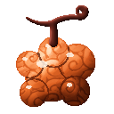
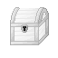
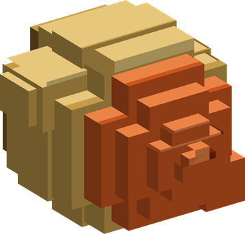
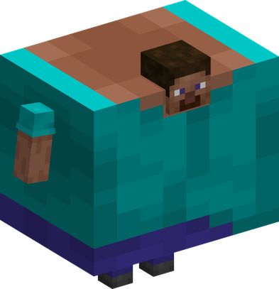

# Pamu Pamu no Mi

{ .mod-icon }

| | |
|---|---|
| **Type** | Paramecia |
| **Theme** | Burst |
| **Box** | { .box-icon } Iron |
| **Chance per opening** | iron **2.45%**, wooden **0.122%** ([how it works](index.md#box-odds)) |
| **Abilities** | 9: 9 active, 0 passive |
| **Transformations** | [Fashion Punc](#fashion-punc) |

In 3D: drag to turn, scroll or pinch to zoom.

Found in the base mod's **iron Devil Fruit box**. Eat it and its abilities appear in the ability menu, grouped under the fruit.

!!! note "About the values"
    The values are those of the ability's tooltip in game, with the base mod's default settings. Damage is shown on the base mod's scale, as in the ability screen.

## Met Punc { #met-punc }

{ .ability-icon } *Active*

Makes the user's helmet inflate and explode into shrapnel all around them. The user needs to wear something on their head

| Stat | Value |
|---|---|
| Damage type | Indirect |
| Element | Explosion |
| Cooldown | 10 s |
| Damage | 10 |
| Range | 3.5 blocks (area) |

## Bracchium { #bracchium }

{ .ability-icon } *Active*

Inflates the bands on the user's wrists until they explode, damaging the enemies right in front of them.

| Stat | Value |
|---|---|
| Damage type | Indirect |
| Element | Explosion |
| Cooldown | 8 s |
| Damage | 11 |
| Range | 3 blocks (cone) |

## Jirai Punc { #jirai-punc }

{ .ability-icon } *Active*

Turns the ground around the user into mines for a while, the blocks explodes when an enemy walks on them

| Stat | Value |
|---|---|
| Damage type | Indirect |
| Element | Explosion |
| Cooldown | 20 s |
| Hold | 30 s |
| Damage | 10 |

## Punc Bala { #punc-bala }

{ .ability-icon } *Active*

{ .form-picture }

Inflates bullets into balloons that floats where the user is looking at and explodes on contact.

| Stat | Value |
|---|---|
| Damage type | Indirect, Projectile |
| Element | Explosion |
| Cooldown | 12 s |
| Damage | 7 |

## Catapult Punc { #catapult-punc }

{ .ability-icon } *Active*

Shoots multiple bullets from the launchers on the user's arms, that inflates while flying and explodes on impact

| Stat | Value |
|---|---|
| Damage type | Indirect, Projectile |
| Element | Explosion |
| Damage | 6 |

## Punc Rock Fest { #punc-rock-fest }

{ .ability-icon } *Active*

Makes the ground around the user inflate and explode, damaging and pushing back the enemies.

| Stat | Value |
|---|---|
| Damage type | Indirect |
| Element | Explosion |
| Cooldown | 15 s |
| Damage | 12 |
| Range | 5 blocks (area) |

## Punc Hair { #punc-hair }

{ .ability-icon } *Active*

The user's hair explodes into a lot of needles that paralyzes the enemies they hit.

| Stat | Value |
|---|---|
| Damage type | Slash, Projectile |
| Cooldown | 12 s |
| Damage | 2.5 |

## Fashion Punc { #fashion-punc }

{ .ability-icon } *Active · Transformation*

{ .form-picture }

Inflates the user into a giant balloon, the first hit taken makes it explode instead of damaging the user, launching needles all around

| Stat | Value |
|---|---|
| Damage type | Indirect |
| Element | Explosion |
| Damage | 12 |

## Punc Rock Super Arena { #punc-rock-super-arena }

{ .ability-icon } *Active*

Inflates the ground in a huge area around the user and then makes it all explode at once, damaging all the enemies inside.

| Stat | Value |
|---|---|
| Damage type | Indirect |
| Element | Explosion |
| Cooldown | 60 s |
| Damage | 19 |
| Range | 10 blocks (area) |
