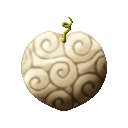
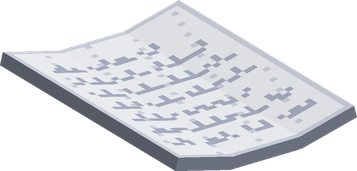
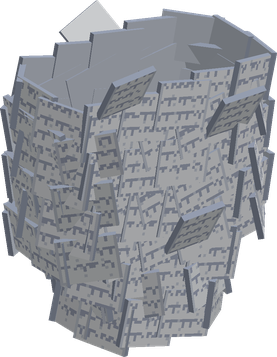
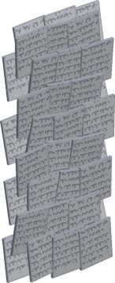

# Pasa Pasa no Mi

{ .mod-icon }

| | |
|---|---|
| **Type** | Logia |
| **Theme** | Paper |
| **Box** | { .box-icon } Golden |
| **Chance per opening** | golden **3.06%**, iron **0.153%**, wooden **0.008%** ([how it works](index.md#box-odds)) |
| **Abilities** | 14: 12 active, 2 passive (1 hidden, not in the ability menu) |
| **Effects applied** | { .effect-mini }[Buried](../effects.md#effect-buried), { .effect-mini }[Scattered](../effects.md#effect-scattered), { .effect-mini }[Warded](../effects.md#effect-warded) |

In 3D: drag to turn, scroll or pinch to zoom.

Found in the base mod's **golden Devil Fruit box**. Eat it and its abilities appear in the ability menu, grouped under the fruit.

!!! note "About the values"
    The values are those of the ability's tooltip in game, with the base mod's default settings. Damage is shown on the base mod's scale, as in the ability screen.

## Logia Invulnerability Pasa { #logia-invulnerability-pasa }

{ .ability-icon } *Passive*

Allows the user to avoid attacks by instinctively transforming parts of their body into their specific element

The user's body is made of sheets of paper, fire always hurts them and deals 50% more damage.

## Paper Swarm { #paper-swarm }

{ .ability-icon } *Active*

The user scatters into a swarm of sheets of paper allowing them to fly. Fire burns the sheets and stops the flight. The swarm ends when they land with no stamina left

## Paper Flight { #paper-flight }

{ .ability-icon } *Passive*

!!! info "Hidden ability"
    It does not appear in the ability menu.

While scattered into a swarm of sheets with Paper Swarm the user can fly, until they have no more stamina

## Paper Blades { #paper-blades }

{ .ability-icon } *Active*

{ .form-picture }

The user throws a volley of sheets of paper as sharp as blades where they are looking

| Stat | Value |
|---|---|
| Damage type | Projectile |
| Haki | Special |

## Paper Storm { #paper-storm }

{ .ability-icon } *Active*

Sheets of paper whirl around the user and keep cutting all the enemies close to them. Fire on the user burns the sheets and ends it

Use the ability again to stop the storm

| Stat | Value |
|---|---|
| Damage type | Slash, Indirect |
| Haki | Special |
| Cooldown | 16 s |
| Hold | 5 s |
| Damage | 3 |
| Range | 3.5 blocks (area) |

## Paper Mummy { #paper-mummy }

{ .ability-icon } *Active*

{ .form-picture }

Applies { .effect-mini }[Buried](../effects.md#effect-buried)

Sheets of paper wrap the enemy the user is looking at like a mummy, they can't move, attack or use abilities and are damaged every second. Fire on the enemy burns the sheets away

| Stat | Value |
|---|---|
| Damage type | Indirect |
| Haki | Special |
| Cooldown | 20 s |
| Hold | 2–4 s |
| Damage | 2–4 |
| Range | 14 blocks (line) |

## Paper Wall { #paper-wall }

{ .ability-icon } *Active*

{ .form-picture }

Sheets of paper gather into a wall in front of the user that stops enemies and projectiles for a while. Fire burns the wall

| Stat | Value |
|---|---|
| Cooldown | 20 s |
| Hold | 10 s |

## Sefer Ha-Bahir { #sefer-ha-bahir }

{ .ability-icon } *Active*

The user throws a page marked with the symbol of brightness at the enemy in front of them, it explodes and sets them on fire

Using it puts the other Sefer on a 10 seconds cooldown

| Stat | Value |
|---|---|
| Damage type | Projectile |
| Element | Fire |
| Haki | Special |
| Cooldown | 12 s |
| Damage | 8–14 |
| Range | 20 blocks (line) |

## Sefer Ha-Zohar { #sefer-ha-zohar }

{ .ability-icon } *Active*

The user throws pages marked with the symbol of splendor at the enemies in front of them, lightning strikes each one and shocks them for a moment

Using it puts the other Sefer on a 10 seconds cooldown

| Stat | Value |
|---|---|
| Damage type | Projectile |
| Element | Lightning |
| Haki | Special |
| Cooldown | 16 s |
| Shock | 1 s |
| Damage | 9 |
| Range | 20 blocks (line) |

## Sefer Atziluth { #sefer-atziluth }

{ .ability-icon } *Active*

The user throws pages marked with the symbol of emanation at the enemies in front of them, poisoning each one

Using it puts the other Sefer on a 10 seconds cooldown

| Stat | Value |
|---|---|
| Damage type | Projectile |
| Element | Poison |
| Haki | Special |
| Cooldown | 16 s |
| Poison | 8 s |
| Damage | 3 |
| Range | 20 blocks (line) |

## Sefer Assiah { #sefer-assiah }

{ .ability-icon } *Active*

The user throws pages marked with the symbol of action at the enemies in front of them, paralysing each one for a few seconds

Using it puts the other Sefer on a 10 seconds cooldown

| Stat | Value |
|---|---|
| Damage type | Projectile |
| Haki | Special |
| Cooldown | 20 s |
| Paralysis | 3 s |
| Damage | 2 |
| Range | 20 blocks (line) |

## Sefer Briah { #sefer-briah }

{ .ability-icon } *Active*

The user marks a page with the symbol of creation that heals them, and keeps healing them for a few seconds

Using it puts the other Sefer on a 10 seconds cooldown

| Stat | Value |
|---|---|
| Cooldown | 45 s |
| Heal | +12 |
| Regeneration | 5 s |

## Sefer Yetzirah { #sefer-yetzirah }

{ .ability-icon } *Active*

Applies { .effect-mini }[Scattered](../effects.md#effect-scattered)

The user marks a page with the symbol of formation and scatters into loose sheets, dodging every attack for a short time, even those imbued with Haki

Using it puts the other Sefer on a 10 seconds cooldown

| Stat | Value |
|---|---|
| Cooldown | 25 s |
| Hold | 3 s |

## Warding Page { #warding-page }

{ .ability-icon } *Active*

Applies { .effect-mini }[Warded](../effects.md#effect-warded)

The user marks a page that protects their paper from fire for a while, fire deals its normal damage and doesn't stop the flight anymore

| Stat | Value |
|---|---|
| Cooldown | 45 s |
| Hold | 20 s |
