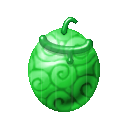
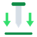
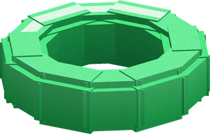

# Peto Peto no Mi

{ .mod-icon }

| | |
|---|---|
| **Type** | Paramecia |
| **Theme** | Pet |
| **Box** | { .box-icon } Iron |
| **Chance per opening** | iron **1.71%**, wooden **0.085%** ([how it works](index.md#box-odds)) |
| **Abilities** | 7: 7 active, 0 passive |
| **Transformations** | [Red Collar](#red-collar) |
| **Effects applied** | { .effect-mini }[Collared](../effects.md#effect-collared), { .effect-mini }[Lowered](../effects.md#effect-lowered) |

In 3D: drag to turn, scroll or pinch to zoom.

Found in the base mod's **iron Devil Fruit box**. Eat it and its abilities appear in the ability menu, grouped under the fruit.

!!! note "About the values"
    The values are those of the ability's tooltip in game, with the base mod's default settings. Damage is shown on the base mod's scale, as in the ability screen.

## Collar { #collar }

{ .ability-icon } *Active*

{ .form-picture }

Applies { .effect-mini }[Collared](../effects.md#effect-collared)

The user throws a collar of jelly, a creature it closes on serves them for 2 minutes and obeys the Command ability. Bosses can't be collared

A player collared for 30 seconds can't be controlled, but suffers the user's Order ability. The user can hold 3 collars at once, and all of them break if the user dies

| Stat | Value |
|---|---|
| Cooldown | 5 s |

## Order { #order }

{ .ability-icon } *Active*

Applies { .effect-mini }[Lowered](../effects.md#effect-lowered)

The user gives a short order to the collared one they are looking at, Lie Down pins them in place and Drop makes them unable to strike. The order is chosen with the alternate mode

A collared player's collar breaks after 3 orders

| Stat | Value |
|---|---|
| Cooldown | 6 s |
| Hold | 3–4 s |
| Range | 20 blocks (line) |

## Full Strength { #full-strength }

{ .ability-icon } *Active*

The user orders the collared creature they are looking at to its full strength, it hits harder, runs faster and takes less damage for a while. With none in sight, all the user's creatures nearby are ordered

| Stat | Value |
|---|---|
| Cooldown | 35 s |
| Hold | 20 s |
| Range | 20 blocks (line) |

## Red Collar { #red-collar }

{ .ability-icon } *Active · Transformation*

The user puts a red collar on their own neck and orders themselves to their full strength, they grow, hit harder, move and strike faster and take less damage

When it ends, the user is weak and slow for a while

## Levitation { #peto-levitation }

{ .ability-icon } *Active*

The collared one the user is looking at floats up, helpless, then falls. On a player it counts as one order

| Stat | Value |
|---|---|
| Cooldown | 18 s |
| Hold | 2–3 s |
| Range | 20 blocks (line) |

## Recall { #recall }

{ .ability-icon } *Active*

Every collared creature of the user is brought to their side at once

| Stat | Value |
|---|---|
| Cooldown | 20 s |

## Release { #release }

{ .ability-icon } *Active*

The user breaks the collar of the collared one they are looking at so they can throw a new one. If they look at no one all their collars break

| Stat | Value |
|---|---|
| Cooldown | 2 s |
| Range | 24 blocks (line) |
