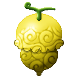
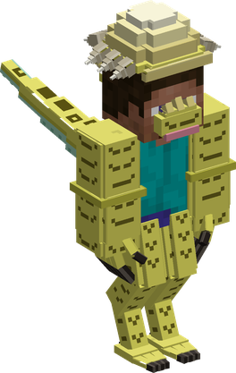
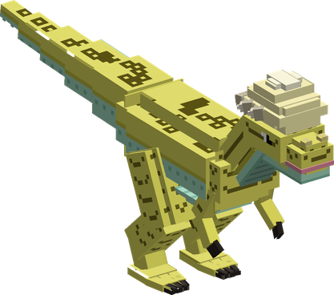

# Ryu Ryu no Mi, Model: Pachycephalosaurus

{ .mod-icon }

| | |
|---|---|
| **Type** | Ancient Zoan |
| **Box** | { .box-icon } Iron |
| **Chance per opening** | iron **1.71%**, wooden **0.085%** ([how it works](index.md#box-odds)) |
| **Abilities** | 10: 8 active, 2 passive |
| **Transformations** | [Pachycephalosaurus Heavy Point](#pachycephalosaurus-heavy-point), [Pachycephalosaurus Walk Point](#pachycephalosaurus-walk-point) |

In 3D: drag to turn, scroll or pinch to zoom.

Found in the base mod's **iron Devil Fruit box**. Eat it and its abilities appear in the ability menu, grouped under the fruit.

!!! note "About the values"
    The values are those of the ability's tooltip in game, with the base mod's default settings. Damage is shown on the base mod's scale, as in the ability screen.

## Pachycephalosaurus Heavy Point { #pachycephalosaurus-heavy-point }

{ .ability-icon } *Active · Transformation*

{ .form-picture }

Transforms the user into a pachycephalosaurus hybrid, which is fast, jumps high and has a skull as hard as a hammer.

## Pachycephalosaurus Walk Point { #pachycephalosaurus-walk-point }

{ .ability-icon } *Active · Transformation*

{ .form-picture }

Transforms the user into a pachycephalosaurus, a big and strong dinosaur that runs on 2 legs and strikes with its head.

## Thick Skull { #thick-skull }

{ .ability-icon } *Passive*

While in a pachycephalosaurus form the user's headbutts stun the enemies they hit, and the user can't be pushed back or stunned while charging

Requires Pachycephalosaurus Heavy Point or Pachycephalosaurus Walk Point to be active.

## Skull Smash { #skull-smash }

{ .ability-icon } *Passive*

While running as a pachycephalosaurus the user rams the enemies in front of them, dealing damage and knocking them back

Requires Pachycephalosaurus Walk Point to be active.

| Stat | Value |
|---|---|
| Haki | Hardening |
| Damage | 3 |

## Ul-Zugan { #ul-zugan }

{ .ability-icon } *Active*

The user leaps where they are looking and headbutts the first enemy they meet. Stronger and from further in the hybrid form

| Stat | Value |
|---|---|
| Damage type | Physical |
| Haki | Hardening |
| Cooldown | 12 s |
| Damage | 18–22 |

## Ul-Meteor { #ul-meteor }

{ .ability-icon } *Active*

While in the hybrid form, the user grabs the enemy in front of them, holds it and headbutts it

| Stat | Value |
|---|---|
| Damage type | Physical |
| Haki | Hardening |
| Cooldown | 15 s |
| Damage | 26 |

## Wall Breaker { #wall-breaker }

{ .ability-icon } *Active*

The user charges forward head first, damaging and stunning all enemies in their path. The charge breaks the blocks in its path, even stone, ores and iron

| Stat | Value |
|---|---|
| Damage type | Physical |
| Haki | Hardening |
| Cooldown | 16 s |
| Damage | 16 |

## Pin Down { #pin-down }

{ .ability-icon } *Active*

While in the full pachycephalosaurus form, the user holds the enemy in front of them under their claws, it can't move and takes damage. Use the ability again to let it go

| Stat | Value |
|---|---|
| Damage type | Physical |
| Haki | Hardening |
| Cooldown | 15 s |
| Hold | 3 s |
| Damage | 3 |

## Tail Sweep { #tail-sweep }

{ .ability-icon } *Active*

The user spins and sweeps their tail around them, hitting all nearby enemies and pushing them away. Stronger and wider in the full pachycephalosaurus form

| Stat | Value |
|---|---|
| Damage type | Physical |
| Haki | Hardening |
| Cooldown | 10 s |
| Damage | 10–13 |
| Range | 3–4.5 blocks (area) |

## Skull Barrage { #skull-barrage }

{ .ability-icon } *Active*

The user headbutts the enemies in front of them many times in a row, the last hit stuns them and sends them back. Faster in the hybrid form, with a longer reach in the full pachycephalosaurus form

| Stat | Value |
|---|---|
| Damage type | Physical |
| Haki | Hardening |
| Cooldown | 13 s |
| Damage | 3.5–21 |
| Range | 2.5–3.5 blocks (line) |
