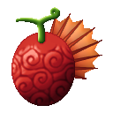
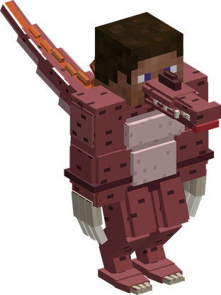
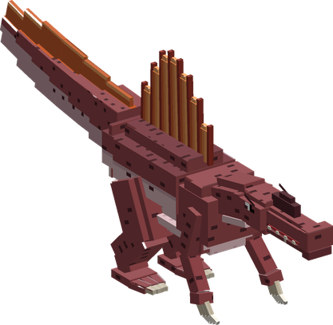

# Ryu Ryu no Mi, Model: Spinosaurus

{ .mod-icon }

| | |
|---|---|
| **Type** | Ancient Zoan |
| **Box** | { .box-icon } Iron |
| **Chance per opening** | iron **1.71%**, wooden **0.085%** ([how it works](index.md#box-odds)) |
| **Abilities** | 9: 8 active, 1 passive |
| **Transformations** | [Spinosaurus Heavy Point](#spinosaurus-heavy-point), [Spinosaurus Walk Point](#spinosaurus-walk-point) |

In 3D: drag to turn, scroll or pinch to zoom.

Found in the base mod's **iron Devil Fruit box**. Eat it and its abilities appear in the ability menu, grouped under the fruit.

!!! note "About the values"
    The values are those of the ability's tooltip in game, with the base mod's default settings. Damage is shown on the base mod's scale, as in the ability screen.

## Spinosaurus Heavy Point { #spinosaurus-heavy-point }

{ .ability-icon } *Active · Transformation*

{ .form-picture }

Transforms the user into a spinosaurus hybrid, which is agile and has big claws to tear their enemies apart.

## Spinosaurus Walk Point { #spinosaurus-walk-point }

{ .ability-icon } *Active · Transformation*

{ .form-picture }

Transforms the user into a spinosaurus, a huge and strong dinosaur with a sail on its back and powerful jaws.

## Frenzy { #frenzy }

{ .ability-icon } *Passive*

While in a spinosaurus form the user deals more damage to enemies that have less than half of their health

Requires Spinosaurus Heavy Point or Spinosaurus Walk Point to be active.

| Stat | Value |
|---|---|
| Damage on Bleeding Enemies | x1.25 |

## Rending Claw { #rending-claw }

{ .ability-icon } *Active*

While in the spinosaurus hybrid form, the user slashes the enemies in front of them with their claws, making them bleed and sending them flying

| Stat | Value |
|---|---|
| Damage type | Physical |
| Haki | Hardening |
| Cooldown | 10 s |
| Damage | 18 |
| Range | 2.5 blocks (line) |

## Shred { #shred }

{ .ability-icon } *Active*

While in the spinosaurus hybrid form, the user slashes the enemies in front of them many times with both claws, each hit makes them bleed longer

| Stat | Value |
|---|---|
| Damage type | Physical |
| Haki | Hardening |
| Cooldown | 12 s |
| Damage | 3–18 |
| Range | 2.5 blocks (line) |

## Cling { #cling }

{ .ability-icon } *Active*

While in the spinosaurus hybrid form, the user latches onto the enemy in front of them and mauls it, it is slowed, bleeds and takes damage. Use the ability again to let go

| Stat | Value |
|---|---|
| Damage type | Physical |
| Haki | Hardening |
| Cooldown | 16 s |
| Hold | 4 s |
| Damage | 3 |

## Jaw Crush { #jaw-crush }

{ .ability-icon } *Active*

While in the full spinosaurus form, the user bites the enemy in front of them with their powerful jaws, dealing heavy damage and making it bleed

| Stat | Value |
|---|---|
| Damage type | Physical |
| Haki | Hardening |
| Cooldown | 12 s |
| Damage | 24 |
| Range | 4 blocks (line) |

## Paddle Tail { #paddle-tail }

{ .ability-icon } *Active*

While in the full spinosaurus form, the user spins and sweeps their huge tail around them, hitting all nearby enemies, pushing them away and breaking weak blocks

| Stat | Value |
|---|---|
| Damage type | Physical |
| Haki | Hardening |
| Cooldown | 15 s |
| Damage | 16 |
| Range | 6 blocks (area) |

## Crushing Leap { #crushing-leap }

{ .ability-icon } *Active*

While in the full spinosaurus form, the user leaps high where they are looking and crushes the ground when landing, damaging and pushing away all nearby enemies

| Stat | Value |
|---|---|
| Damage type | Physical |
| Haki | Hardening |
| Cooldown | 16 s |
| Damage | 18 |
| Range | 5 blocks (area) |
