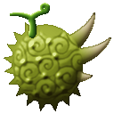
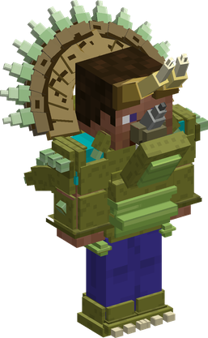
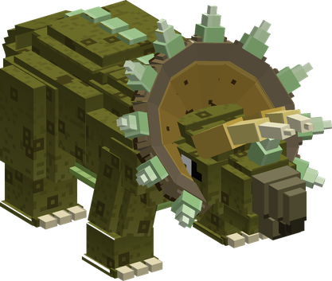

# Ryu Ryu no Mi, Model: Triceratops

{ .mod-icon }

| | |
|---|---|
| **Type** | Ancient Zoan |
| **Box** | { .box-icon } Iron |
| **Chance per opening** | iron **1.71%**, wooden **0.085%** ([how it works](index.md#box-odds)) |
| **Abilities** | 11: 9 active, 2 passive (1 hidden, not in the ability menu) |
| **Transformations** | [Triceratops Heavy Point](#triceratops-heavy-point), [Triceratops Guard Point](#triceratops-guard-point) |

In 3D: drag to turn, scroll or pinch to zoom.

Found in the base mod's **iron Devil Fruit box**. Eat it and its abilities appear in the ability menu, grouped under the fruit.

!!! note "About the values"
    The values are those of the ability's tooltip in game, with the base mod's default settings. Damage is shown on the base mod's scale, as in the ability screen.

## Triceratops Heavy Point { #triceratops-heavy-point }

{ .ability-icon } *Active · Transformation*

{ .form-picture }

Transforms the user into a triceratops hybrid, with 3 horns, a thick hide and a frill that spins to fly.

## Triceratops Guard Point { #triceratops-guard-point }

{ .ability-icon } *Active · Transformation*

{ .form-picture }

Transforms the user into a triceratops, a huge and slow beast on 4 legs with the thickest hide.

## Thick Hide { #thick-hide }

{ .ability-icon } *Passive*

While in a triceratops form a single hit can't deal more than 30% of the user's max health, or 20% as the full triceratops

Requires Triceratops Heavy Point or Triceratops Guard Point to be active.

## Frill Flight { #frill-flight }

{ .ability-icon } *Active*

The user's frill spins like a propeller around their neck allowing them to fly for a while

| Stat | Value |
|---|---|
| Cooldown | 15 s |
| Hold | 20 s |

## Triceratops Flight { #triceratops-flight }

*Passive*

!!! info "Hidden ability"
    It does not appear in the ability menu.

Requires Triceratops Heavy Point to be active.

## Tamaceratops { #tamaceratops }

{ .ability-icon } *Active*

While in the hybrid form, the user's frill spins and propels them forward horns first, damaging all enemies in their path and throwing them away

| Stat | Value |
|---|---|
| Damage type | Physical |
| Haki | Hardening |
| Cooldown | 12 s |
| Damage | 20 |

## Magnumceratops { #magnumceratops }

{ .ability-icon } *Active*

While flying with the frill, the user dives head first where they are looking, damaging all enemies around the impact and sending them flying. The damage is higher when diving from high up

| Stat | Value |
|---|---|
| Damage type | Physical |
| Haki | Hardening |
| Cooldown | 14 s |
| Damage | 16–30 |
| Range | 4 blocks (area) |

## Heliceratops { #heliceratops }

{ .ability-icon } *Active*

While flying with the frill, the user strikes the enemies in front of them many times with what they are holding, the last hit sends them flying. A better weapon deals more damage

| Stat | Value |
|---|---|
| Damage type | Physical |
| Haki | Hardening |
| Cooldown | 14 s |
| Damage | 3–9 |
| Range | 4 blocks (line) |

## Horn Charge { #horn-charge }

{ .ability-icon } *Active*

While in the full triceratops form, the user charges forward horns first, damaging all enemies in their path and throwing them far away. The charge also breaks the blocks in its path, up to stone.

| Stat | Value |
|---|---|
| Damage type | Physical |
| Haki | Hardening |
| Cooldown | 18 s |
| Damage | 26 |

## Horn Lift { #horn-lift }

{ .ability-icon } *Active*

While in the full triceratops form, the user puts their horns under the enemies in front of them and throws them in the air

| Stat | Value |
|---|---|
| Damage type | Physical |
| Haki | Hardening |
| Cooldown | 10 s |
| Damage | 14 |
| Range | 5 blocks (line) |

## Ground Stomp { #ground-stomp }

{ .ability-icon } *Active*

While in the full triceratops form, the user stomps the ground, all nearby enemies standing on it are damaged, pushed away and slowed

| Stat | Value |
|---|---|
| Damage type | Physical |
| Haki | Hardening |
| Cooldown | 14 s |
| Damage | 10 |
| Range | 7 blocks (area) |
