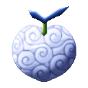

# Toki Toki no Mi

{ .mod-icon }

| | |
|---|---|
| **Type** | Paramecia |
| **Theme** | Time |
| **Box** | { .box-icon } Golden |
| **Chance per opening** | golden **3.06%**, iron **0.153%**, wooden **0.008%** ([how it works](index.md#box-odds)) |
| **Abilities** | 4: 4 active, 0 passive |

Found in the base mod's **golden Devil Fruit box**. Eat it and its abilities appear in the ability menu, grouped under the fruit.

!!! note "About the values"
    The values are those of the ability's tooltip in game, with the base mod's default settings. Damage is shown on the base mod's scale, as in the ability screen.

## Jump Ahead { #jump-ahead }

{ .ability-icon } *Active*

The user leaps ahead in time, they vanish, out of everyone's reach, and come back at the same place once the chosen time has passed.

Used again while away, it brings the user back at once

The ability mode key changes how far ahead, 5, 10, 20 or 30 seconds

| Stat | Value |
|---|---|
| Cooldown | 15–45 s |
| Hold | 5–30 s |

## Shelter { #shelter }

{ .ability-icon } *Active*

The ally the user touches is sent ahead in time, out of danger. They vanish, out of everyone's reach, and come back at the same place once the chosen time has passed. A player must be crouching to be sent.

The ability mode key changes how far ahead, 5, 10, 20 or 30 seconds

| Stat | Value |
|---|---|
| Cooldown | 25–50 s |
| Range | 4.5 blocks (line) |

## Send Ahead { #send-ahead }

{ .ability-icon } *Active*

The enemy the user touches is sent ahead in time, they vanish, out of everyone's reach, and come back at the same place once the chosen time has passed.

The ability mode key changes how far ahead, 3, 5 or 10 seconds

| Stat | Value |
|---|---|
| Cooldown | 36–50 s |
| Range | 4.5 blocks (line) |

## Postpone { #postpone }

{ .ability-icon } *Active*

The shots in flight in front of the user are sent ahead in time, they vanish and reappear where they were, still on their way, once the chosen time has passed.

The ability mode key changes how far ahead, 2, 5 or 10 seconds

| Stat | Value |
|---|---|
| Cooldown | 12 s |
| Range | 8 blocks (area) |
