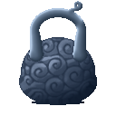
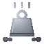
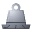

# Ton Ton no Mi

{ .mod-icon }

| | |
|---|---|
| **Type** | Paramecia |
| **Theme** | Weight |
| **Box** | { .box-icon } Iron |
| **Chance per opening** | iron **2.45%**, wooden **0.122%** ([how it works](index.md#box-odds)) |
| **Abilities** | 6: 6 active, 0 passive |

Found in the base mod's **iron Devil Fruit box**. Eat it and its abilities appear in the ability menu, grouped under the fruit.

!!! note "About the values"
    The values are those of the ability's tooltip in game, with the base mod's default settings. Damage is shown on the base mod's scale, as in the ability screen.

## Float { #float }

{ .ability-icon } *Active*

The user removes their weight and floats into the air, from where a Vise can be used. The user takes no fall damage after it

| Stat | Value |
|---|---|
| Cooldown | 2–7 s |
| Hold | 10 s |

## Jutton Vise { #jutton-vise }

{ .ability-icon } *Active*

While in the air, the user becomes 10 tonnes heavy and falls on the enemies below. The damage is higher the bigger the fall is.

| Stat | Value |
|---|---|
| Damage type | Blunt, Physical |
| Haki | Hardening |
| Cooldown | 8 s |
| Damage | 6–16 |
| Range | 3 blocks (area) |

## Hyakuton Vise { #hyakuton-vise }

{ .ability-icon } *Active*

While in the air, the user becomes 100 tonnes heavy and falls on the enemies below. The damage is higher the bigger the fall is

| Stat | Value |
|---|---|
| Damage type | Blunt, Physical |
| Haki | Hardening |
| Cooldown | 15 s |
| Damage | 10–24 |
| Range | 4 blocks (area) |

## Hakai no Senton Vise { #hakai-no-senton-vise }

{ .ability-icon } *Active*

While in the air, the user becomes 1000 tonnes heavy and falls on the enemies below, creating a crater. The damage is higher the bigger the fall is.

| Stat | Value |
|---|---|
| Damage type | Blunt, Physical |
| Haki | Hardening |
| Cooldown | 30 s |
| Damage | 14–30 |
| Range | 6 blocks (area) |

## Jigoku no Manton Vise { #jigoku-no-manton-vise }

{ .ability-icon } *Active*

While in the air, the user becomes 10000 tonnes heavy and falls on the enemies below, creating a huge crater. The damage is higher the bigger the fall is

| Stat | Value |
|---|---|
| Damage type | Blunt, Physical |
| Haki | Hardening |
| Cooldown | 60 s |
| Damage | 20–36 |
| Range | 8 blocks (area) |

## Heavy Body { #heavy-body }

{ .ability-icon } *Active*

Makes the user very heavy, they take no knockback and less damage but moves slowly and can barely jump. Landing on enemies damages them.

| Stat | Value |
|---|---|
| Cooldown | 2 s |
| Hold | ∞ s |

**Stats while active**

| Stat | Value |
|---|---|
| Knockback Resistance | +1 |
| Armor Toughness | +4 |
| Jump Height | -0.6 |
| Speed | -0.04 |
| Armor | +8 |
