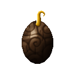
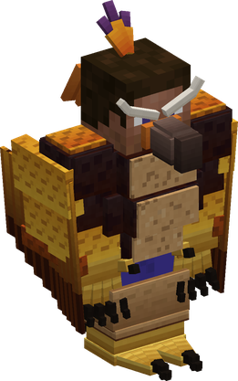
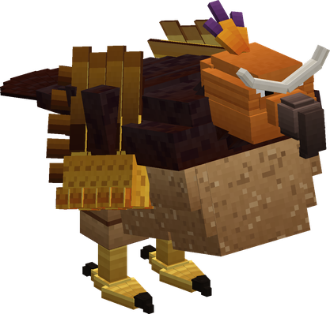

# Tori Tori no Mi, Model: Eagle

{ .mod-icon }

| | |
|---|---|
| **Type** | Zoan |
| **Box** | { .box-icon } Iron |
| **Chance per opening** | iron **1.71%**, wooden **0.085%** ([how it works](index.md#box-odds)) |
| **Abilities** | 7: 6 active, 1 passive (1 hidden, not in the ability menu) |
| **Transformations** | [Eagle Assault Point](#eagle-assault-point), [Eagle Fly Point](#eagle-fly-point) |

In 3D: drag to turn, scroll or pinch to zoom.

Found in the base mod's **iron Devil Fruit box**. Eat it and its abilities appear in the ability menu, grouped under the fruit.

!!! note "About the values"
    The values are those of the ability's tooltip in game, with the base mod's default settings. Damage is shown on the base mod's scale, as in the ability screen.

## Eagle Assault Point { #eagle-assault-point }

{ .ability-icon } *Active · Transformation*

{ .form-picture }

Transforms the user into an eagle hybrid, heavy and tough, which can fly and still use weapons.

## Eagle Fly Point { #eagle-fly-point }

{ .ability-icon } *Active · Transformation*

{ .form-picture }

Transforms the user into a great eagle, which flies and can carry off its prey in its talons

## Eagle Flight { #eagle-flight }

*Passive*

!!! info "Hidden ability"
    It does not appear in the ability menu.

Requires Eagle Hybrid or Eagle to be active.

## Talon Strike { #talon-strike }

{ .ability-icon } *Active*

While in the air, the user dives at the target and strikes it with their talons with all their weight, pushing it back and slowing it

| Stat | Value |
|---|---|
| Damage type | Physical |
| Haki | Hardening |
| Cooldown | 10 s |
| Damage | 18 |
| Dazed Lasts | 1.5 s |

## Carry Off { #carry-off }

{ .ability-icon } *Active*

While in the eagle form, the user grabs the enemy under them with their talons and carries it off. Use the ability again to drop it.

| Stat | Value |
|---|---|
| Cooldown | 12 s |
| Hold | 8 s |

## Wing Gust { #wing-gust }

{ .ability-icon } *Active*

The user beats their great wings, throwing far back all enemies in front of them, projectiles are also sent back

| Stat | Value |
|---|---|
| Damage type | Indirect |
| Element | Wind |
| Haki | Special |
| Cooldown | 12 s |
| Range | 8 blocks (area) |
| Damage | 5 |

## Screech { #screech }

{ .ability-icon } *Active*

The user lets out a piercing cry that shakes all enemies around them, slowing and weakening them for a moment

| Stat | Value |
|---|---|
| Cooldown | 20 s |
| Range | 10 blocks (area) |
| Shaken Lasts | 5 s |
