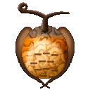
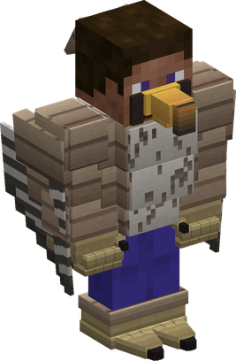
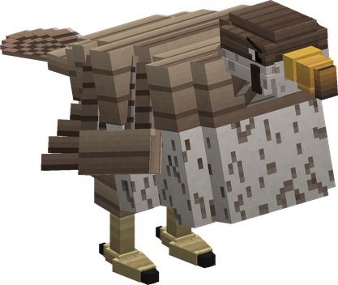
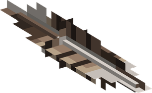

# Tori Tori no Mi, Model: Falcon

{ .mod-icon }

| | |
|---|---|
| **Type** | Zoan |
| **Box** | { .box-icon } Iron |
| **Chance per opening** | iron **1.71%**, wooden **0.085%** ([how it works](index.md#box-odds)) |
| **Abilities** | 11: 9 active, 2 passive (1 hidden, not in the ability menu) |
| **Transformations** | [Falcon Assault Point](#falcon-assault-point), [Falcon Fly Point](#falcon-fly-point) |

In 3D: drag to turn, scroll or pinch to zoom.

Found in the base mod's **iron Devil Fruit box**. Eat it and its abilities appear in the ability menu, grouped under the fruit.

!!! note "About the values"
    The values are those of the ability's tooltip in game, with the base mod's default settings. Damage is shown on the base mod's scale, as in the ability screen.

## Falcon Assault Point { #falcon-assault-point }

{ .ability-icon } *Active · Transformation*

{ .form-picture }

Transforms the user into a falcon hybrid, which can fly and still use weapons.

## Falcon Fly Point { #falcon-fly-point }

{ .ability-icon } *Active · Transformation*

{ .form-picture }

Transforms the user into a big falcon, which flies fast and can carry another player

## Falcon Flight { #falcon-flight }

*Passive*

!!! info "Hidden ability"
    It does not appear in the ability menu.

Requires Falcon Assault Point or Falcon Fly Point to be active.

## Falcon Rideable { #falcon-rideable }

{ .ability-icon } *Passive*

Allows another player to ride on the falcon's back.

Requires Falcon Fly Point to be active.

## Tobizume { #tobizume }

{ .ability-icon } *Active*

While in the air, the user dives at the target and slashes it with their talons

| Stat | Value |
|---|---|
| Damage type | Slash, Physical |
| Haki | Hardening |
| Cooldown | 8 s |
| Damage | 12 |

## Tsukami Otoshi { #tsukami-otoshi }

{ .ability-icon } *Active*

While in the falcon form, the user grabs the enemy under them with their talons and carries it. Use the ability again to drop it.

| Stat | Value |
|---|---|
| Cooldown | 12 s |
| Hold | 6 s |

## Hane Arashi { #hane-arashi }

{ .ability-icon } *Active*

The user flaps their wings pushing back all enemies in front of them, projectiles are also sent back

| Stat | Value |
|---|---|
| Damage type | Indirect |
| Element | Wind |
| Haki | Special |
| Cooldown | 10 s |
| Range | 7 blocks (area) |
| Damage | 3 |

## Kyukoka { #kyukoka }

{ .ability-icon } *Active*

While in the air, the user dives straight down at very high speed, damaging all enemies around the impact and sending them flying. The damage is higher the bigger the dive is

| Stat | Value |
|---|---|
| Damage type | Blunt, Physical |
| Haki | Hardening |
| Cooldown | 15 s |
| Damage | 10–20 |
| Range | 4 blocks (area) |

## Kagizume { #kagizume }

{ .ability-icon } *Active*

While in the hybrid form, the user slashes the enemies in front of them a few times with their talons, the last slash sends them in the air

| Stat | Value |
|---|---|
| Damage type | Slash, Physical |
| Haki | Hardening |
| Cooldown | 11 s |
| Damage | 16 |
| Range | 3 blocks (line) |

## Hayabusa no Me { #hayabusa-no-me }

{ .ability-icon } *Active*

The user looks around with the eyes of a falcon, all living beings around them can be seen through walls for 10 seconds

| Stat | Value |
|---|---|
| Cooldown | 30 s |
| Hold | 10 s |
| Range | 40 blocks (area) |

## Hane Tsubute { #hane-tsubute }

{ .ability-icon } *Active*

{ .form-picture }

The user flaps their wings throwing 4 sharp feathers where they are looking

| Stat | Value |
|---|---|
| Damage type | Slash, Projectile |
| Haki | Imbuing |
| Cooldown | 8 s |
| Damage | 4 |
