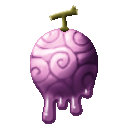
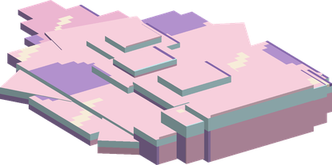
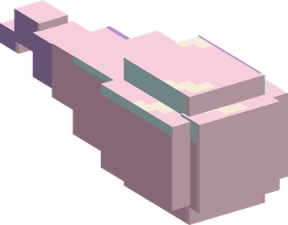
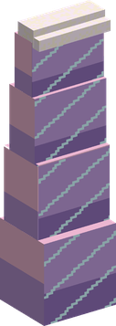
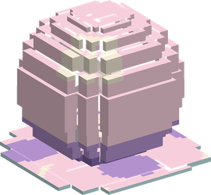

# Toro Toro no Mi

{ .mod-icon }

| | |
|---|---|
| **Type** | Logia |
| **Theme** | Liquid |
| **Box** | { .box-icon } Iron |
| **Chance per opening** | iron **1.71%**, wooden **0.085%** ([how it works](index.md#box-odds)) |
| **Abilities** | 8: 7 active, 1 passive |
| **Transformations** | [Flow](#flow) |

In 3D: drag to turn, scroll or pinch to zoom.

Found in the base mod's **iron Devil Fruit box**. Eat it and its abilities appear in the ability menu, grouped under the fruit.

!!! note "About the values"
    The values are those of the ability's tooltip in game, with the base mod's default settings. Damage is shown on the base mod's scale, as in the ability screen.

## Logia Invulnerability Toro { #logia-invulnerability-toro }

{ .ability-icon } *Passive*

Allows the user to avoid attacks by instinctively transforming parts of their body into their specific element

Powder snow and freezing lock the user's liquid body in place, and it then lets every hit through

## Flow { #flow }

{ .ability-icon } *Active · Transformation*

{ .form-picture }

The user becomes a pool of liquid that slides fast along the ground, under low ceilings and through one-block openings

Pressed against bars, a fence or a gate, the pool flows through it. As a pool the user cannot attack, except with Geyser

Geyser and Slick are only used as a pool

## Liquid Blast { #liquid-blast }

{ .ability-icon } *Active*

{ .form-picture }

The user shoots a jet of liquid where the user is looking, which hits the first enemy in its way and pushes it far back

| Stat | Value |
|---|---|
| Damage type | Blunt, Projectile |
| Haki | Special |
| Cooldown | 5 s |
| Damage | 8 |

## Great Wave { #great-wave }

{ .ability-icon } *Active*

{ .form-picture }

The user sends a great wave of liquid in front of them, which hits all enemies in its path and sweeps them far away

| Stat | Value |
|---|---|
| Damage type | Blunt, Indirect |
| Haki | Special |
| Cooldown | 15 s |
| Damage | 12 |
| Range | 12 blocks (line) |

## Liquid Sphere { #liquid-sphere }

{ .ability-icon } *Active*

{ .form-picture }

Traps the enemy the user is looking at inside a sphere of liquid, which holds it and drowns it

| Stat | Value |
|---|---|
| Damage type | Blunt, Indirect |
| Haki | Special |
| Cooldown | 18 s |
| Damage | 10 |
| Hold | 4 s |

## Geyser { #geyser }

{ .ability-icon } *Active*

Only as a pool. The pool bursts up in a column of liquid that hits all enemies standing over it and throws them in the air, and the user takes shape again

| Stat | Value |
|---|---|
| Damage type | Blunt, Indirect |
| Haki | Special |
| Cooldown | 12 s |
| Damage | 10 |
| Range | 2.5 blocks (area) |

## Pressure Jet { #pressure-jet }

{ .ability-icon } *Active*

The user shoots a thin jet of liquid under pressure that follows where the user is looking. It goes through enemies and keeps hitting all those on its line, without pushing them

Use the ability again to stop the jet

| Stat | Value |
|---|---|
| Damage type | Blunt, Indirect |
| Haki | Special |
| Cooldown | 14 s |
| Hold | 2 s |
| Damage | 4 |
| Range | 14 blocks (line) |

## Slick { #slick }

{ .ability-icon } *Active*

Only as a pool. The pool leaves a trail of liquid on the ground it slides over, everyone else slips on it as on ice

The trail stays until the ability ends, even after the user takes shape again. Use the ability again to remove it

The ground is covered with **Liquid Trail**.

| Stat | Value |
|---|---|
| Cooldown | 20 s |
| Hold | 10 s |
