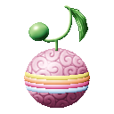
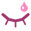
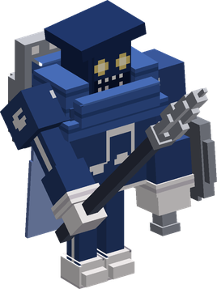
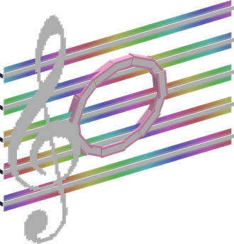
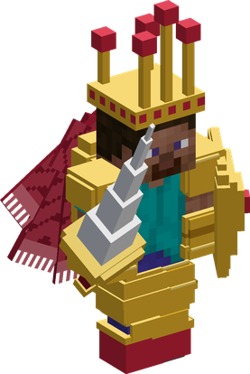
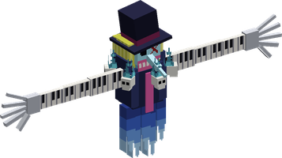

# Uta Uta no Mi

{ .mod-icon }

| | |
|---|---|
| **Type** | Paramecia |
| **Theme** | Song |
| **Box** | { .box-icon } Golden |
| **Chance per opening** | golden **3.06%**, iron **0.153%**, wooden **0.008%** ([how it works](index.md#box-odds)) |
| **Abilities** | 7: 6 active, 1 passive |
| **Transformations** | [Knight Form](#knight-form) |
| **Effects applied** | { .effect-mini }[Exhausted](../effects.md#effect-exhausted), { .effect-mini }[Just Woken](../effects.md#effect-just-woken), { .effect-mini }[Puppet](../effects.md#effect-puppet), { .effect-mini }[Wide Awake](../effects.md#effect-wide-awake) |

In 3D: drag to turn, scroll or pinch to zoom.

Found in the base mod's **golden Devil Fruit box**. Eat it and its abilities appear in the ability menu, grouped under the fruit.

!!! note "About the values"
    The values are those of the ability's tooltip in game, with the base mod's default settings. Damage is shown on the base mod's scale, as in the ability screen.

## Song { #uta-song }

{ .ability-icon } *Active*

Applies { .effect-mini }[Exhausted](../effects.md#effect-exhausted), { .effect-mini }[Just Woken](../effects.md#effect-just-woken), { .effect-mini }[Puppet](../effects.md#effect-puppet), { .effect-mini }[Wide Awake](../effects.md#effect-wide-awake)

The user sings for a few seconds. Every player still in range at the end is sent to Uta World with the user, their bodies stay asleep where they stood. A hit interrupts the song

Creatures in range fall asleep, all but bosses become the user's puppets. A hit on a sleeping body wakes its player, a hit on the user's body ends the dream for everyone

A player defeated in the dream wakes up and takes heavy damage, and so does the user. While alone in the dream, the user can use this again to end it

Uta World is built of its own blocks, which nothing breaks: Dream Stage, Dream Floor, Dream Wall, Dream Frame, Dream Curtain and Dream Light.

| Stat | Value |
|---|---|
| Cooldown | 30–120 s |
| Charge | 3 s |
| Range | 16 blocks (area) |

## Musical Note Soldiers { #note-soldiers }

{ .ability-icon } *Active*

{ .form-picture }

In Uta World, the user calls soldiers shaped like musical notes that fight for the user. A soldier that is struck down scatters into notes and forms again

| Stat | Value |
|---|---|
| Cooldown | 30 s |
| Damage | 7 |

## Staff { #uta-staff }

{ .ability-icon } *Active*

{ .form-picture }

In Uta World, the user pins the enemy looked at on a musical staff, where it cannot move or strike. Using it again releases the enemy

| Stat | Value |
|---|---|
| Damage type | Indirect |
| Haki | Special |
| Cooldown | 16 s |
| Hold | 4 s |
| Damage | 6 |
| Range | 14 blocks (line) |

## Trick or Treat { #trick-or-treat }

{ .ability-icon } *Active*

In Uta World, the user rides a giant musical note that rams forward where the user is looking, hitting and throwing aside every enemy in its way

| Stat | Value |
|---|---|
| Damage type | Blunt |
| Haki | Special |
| Cooldown | 12 s |
| Damage | 12 |

## Knight Form { #knight-form }

{ .ability-icon } *Active · Transformation*

{ .form-picture }

Applies { .effect-mini }[Exhausted](../effects.md#effect-exhausted), { .effect-mini }[Puppet](../effects.md#effect-puppet)

In Uta World, the user puts on golden armour with a lance and a shield, becoming tougher and hitting harder and from further away

## Tot Musica { #tot-musica }

{ .ability-icon } *Active*

{ .form-picture }

Applies { .effect-mini }[Exhausted](../effects.md#effect-exhausted), { .effect-mini }[Puppet](../effects.md#effect-puppet)

In Uta World, the user sings the forbidden song. Tot Musica appears, absorbs the user and attacks everyone in the dream. The user can do nothing more and the voice gauge empties twice as fast

If Tot Musica is defeated, the dream ends and the user is defeated with it. It must be used twice in a row to confirm

## Voice { #uta-voice }

{ .ability-icon } *Passive*

Applies { .effect-mini }[Exhausted](../effects.md#effect-exhausted), { .effect-mini }[Puppet](../effects.md#effect-puppet)

The user's dream lasts as long as the user's voice. The dream empties the gauge and ends when it is empty, the gauge fills again over time

In the dream the user flies freely. In the real world, the creatures put to sleep by the song gather around the user's sleeping body and guard it
