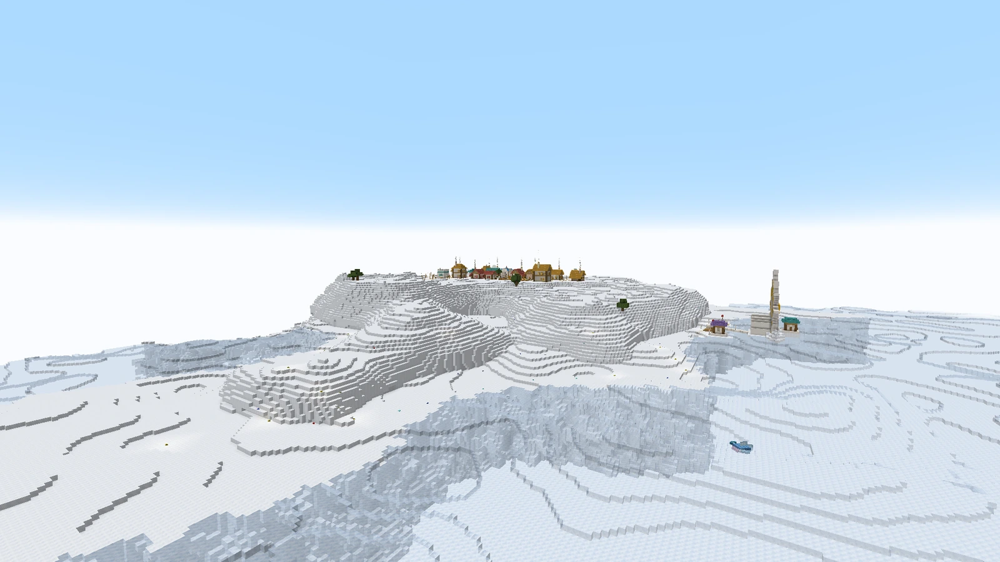
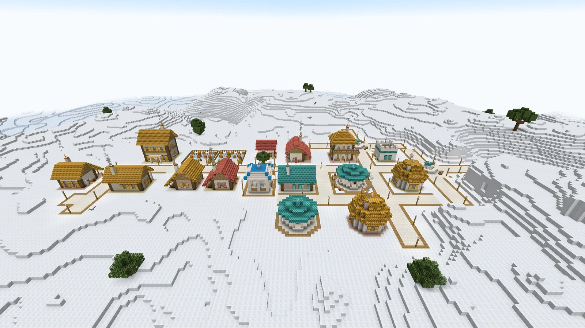
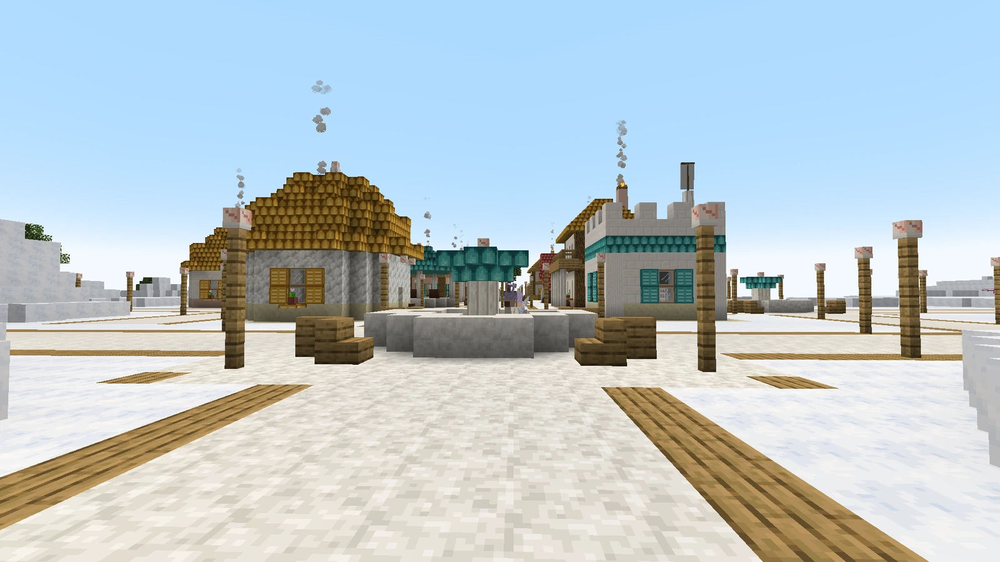
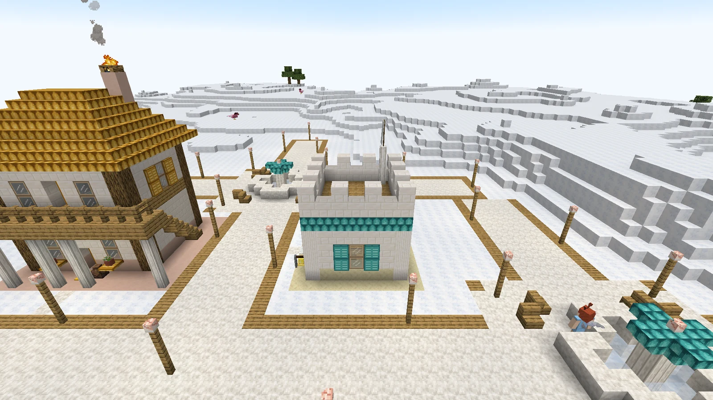
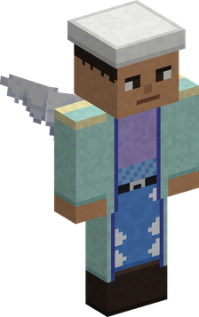
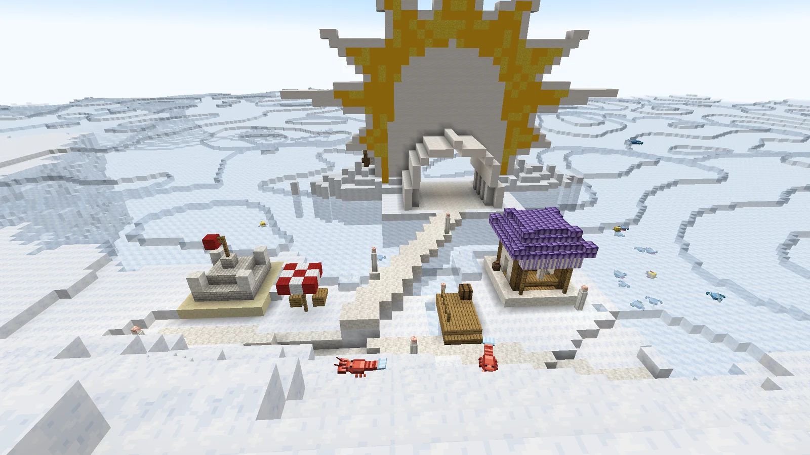
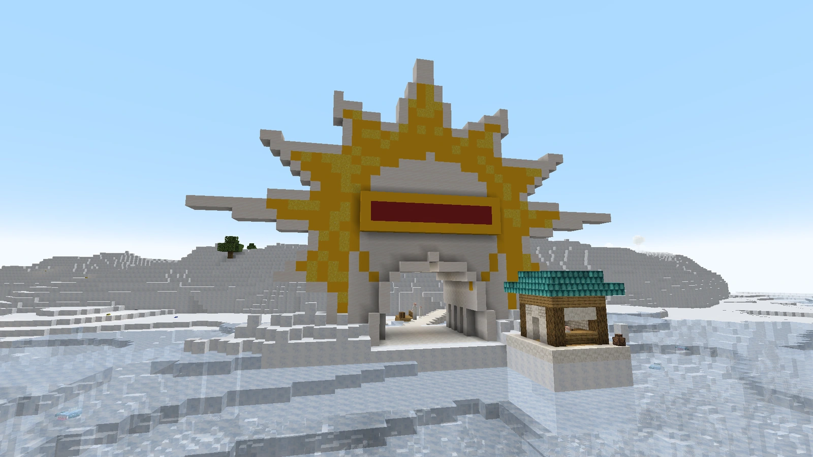

# Angel Islands

<figure class="place" markdown>
{ target="_blank" title="Open the picture full size" }
<figcaption>An Angel Island: its village, its cliff, and Angel Beach at its foot.</figcaption>
</figure>

Two islands in three are **Angel Islands**: low islands made of **island cloud from top to bottom**, a few trees rooted in the cloud. Their shore is a cliff down to a flat shelf at the level of the cloud sea — Angel Beach.

## Skypiean villages

<figure class="place" markdown>
{ target="_blank" title="Open the picture full size" }
<figcaption>A Skypiean village.</figcaption>
</figure>

Every Angel Island has a village of houses in **cloud brick, cut cloud and shell tiles**, with streets edged in oak, lamp posts and a square. The **larger islands have larger villages**, with:

- an **inn**, amber-roofed, with a bar, tables and rooms upstairs;
- a **dial shop**, coral-roofed, its shells on show along the counter;
- a **bandstand**;
- **kitchen gardens** on cloud farmland;
- a **cloud fountain**;
- in one village in three, a **climate terrace** where [Haredas](weatheria.md#its-people) teaches the Art of Weather.

### The houses

<figure class="place" markdown>
{ target="_blank" title="Open the picture full size" }
<figcaption>A village square: the cloud fountain, and the White Berets' post behind it.</figcaption>
</figure>

**Five shapes**: the family house under its gable, a two-storey house with a balcony, the fisherman's house with its catch drying under a long roof, a round house under a dome, and a house with a gallery. Each house draws **its own colours**: a roof of turquoise, coral, amber or lilac shell tiles, shutters and a door painted to match, and its own walls.

They are **furnished**: a table and chairs, a kitchen whose chimney smokes, beds, shelves, carpets, flowers at the windows.

### The Skypieans

The villagers are **sky people of this mod**: eight people, men and women, young and old, with small wings at the shoulders and their hair grown into **antennae**. The **dial merchant** is one of them, in a blue apron behind his counter; he sells the base mod's dials. The White Berets protect them.

Villages generated before 0.3.0 keep the base mod's Skypieans and their old houses.

### Cloud farmland

A **hoe tills island cloud** into cloud farmland, and crops grow in it **exactly as in farmland**: water nearby keeps it moist — **or sea cloud**, which a [Sea Cloud Bucket](blocks.md#the-clouds) carries to your field — and trampled or left bare it turns back into island cloud.

### The village blocks

Every block the villages are built from can be crafted: cloud brick, cut cloud, cloud pillars and walls, shell tiles in four colours, painted shutters and doors, awning cloth, cloud glass, conch lanterns and Vearth urns. Their recipes are on the [Blocks](blocks.md) page.

## The White Berets

<figure class="place" markdown>
{ target="_blank" title="Open the picture full size" }
<figcaption>The White Berets' post.</figcaption>
</figure>

Skypiea's police. Every village has their **post** — a small tower of white stone with battlements, a cell and a bell — with a rare chest of seized goods, and the **White Beret Guards** (the recruits) and a **White Beret Captain** who keep order in the village. Under the same uniform there are **eight faces**: skin, hair, eyes, a moustache, a beard or a scar. They are calibrated against the base mod's own NPCs — the captain is the stronger, with Busoshoku Haki.

<figure markdown>

<figcaption>The White Beret Captain</figcaption>
</figure>

<figure markdown>

<figcaption>A White Beret Guard</figcaption>
</figure>

## Angel Beach

<figure class="place" markdown>
{ target="_blank" title="Open the picture full size" }
<figcaption>The seafront: the dial workshop and the pier, deck chairs, a castle of cloud. Heaven's Gate stands in front of it.</figcaption>
</figure>

The flat shore at the foot of an Angel Island's cliffs.

- **Dials wash up on the beach over time**, a few at a time, and are picked up like any item. How often, and how many a stretch of beach holds, is in the [configuration](configuration.md).
- **A seafront**, once per village island, facing the island's geyser: the **dial workshop** under its lilac awning, a promenade along the shore, a pier, deck chairs, and sometimes a castle of cloud. Behind the workshop's counter stands the **Waver Dealer**, who sells the [waver](getting-around.md#the-waver).
- **White Beret lookouts** along the shore wherever it has room, never within 64 blocks of the seafront or of another lookout, each with its guard.
- **Sky Lobsters** walk the beach (see [Wildlife](wildlife.md#the-cloud-sea)).

## Heaven's Gate

<figure class="place" markdown>
{ target="_blank" title="Open the picture full size" }
<figcaption>Heaven's Gate, from the cloud sea.</figcaption>
</figure>

The way into Skypiea, on every village island: the **gate**, its **tunnel** through the bank of cloud, and a **causeway** from the tunnel to the promenade. The geyser sets you down right in front of it.
