# Blocks

Sky Island adds **14 blocks you can hold**: the three clouds Skypiea is made of, and the eleven blocks its villages are built from. Every village block can be crafted, so a Skypiean house can be built anywhere.

Turn a block round (drag), zoom (scroll or pinch), and pick another with the buttons:

## The clouds

| Block | What it is | How to get it |
|---|---|---|
| 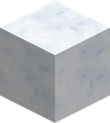{ .block-icon } **Island Cloud** | The cloud you walk on: the ground of the [Angel Islands](angel-islands.md) and the surface of the cloud sea. Soft, quick to break, with the sound of wool. | Dig it in Skypiea. |
| 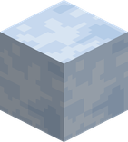{ .block-icon } **Sea Cloud** | The body of the cloud sea. You do not stand on it: you **swim in it**, and falling into it does no harm. It is not water, so it does not weaken a Devil Fruit user. | Dig it in the cloud sea. |
| 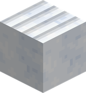{ .block-icon } **Cloud Farmland** | Island cloud tilled with a **hoe**. Crops grow in it exactly as in farmland: water nearby keeps it moist, and trampled or left bare it turns back into island cloud. | Use a hoe on island cloud. Broken, it gives island cloud back. |

## The village blocks

Everything starts from **Island Cloud**. A **stonecutter** makes each block one for one; the crafting grid makes several at a time.

| Block | What it is | Crafting grid | Stonecutter |
|---|---|---|---|
| 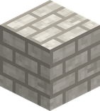{ .block-icon } **Cloud Brick** | The village walls: packed cloud sawn into bricks, harder than island cloud. | 4 Island Cloud in a square → 4 | Island Cloud |
| 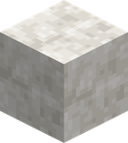{ .block-icon } **Cut Cloud** | The smooth panel: lintels, frames, plinths and paving. | 4 Cloud Brick in a square → 4 | Island Cloud or Cloud Brick |
| 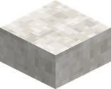{ .block-icon } **Cut Cloud Slab** | The half block of cut cloud. | 3 Cut Cloud in a row → 6 | Cut Cloud |
| 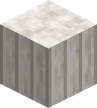{ .block-icon } **Cloud Pillar** | The column: it can stand or lie along any axis, like a log. | 2 Cut Cloud, one on the other → 2 | Cut Cloud |
| 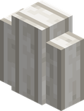{ .block-icon } **Cloud Pillar Wall** | The slender column: a wall that joins its neighbours and stacks into a thin post. | 6 Cloud Pillar, in two rows of three → 6 | Cloud Pillar |
| 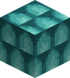{ .block-icon } **Shell Tile** | The roofs: scales of shell, the hardest block of the village. | 8 Cut Cloud around 1 Cyan Dye → 8 | — |
| 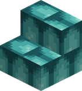{ .block-icon } **Shell Tile Stairs** | The slope of the roofs. | 6 Shell Tile in a staircase → 4 | Shell Tile |
| 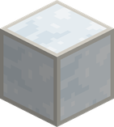{ .block-icon } **Cloud Glass** | The windows: milky and barely see-through, but daylight passes. | Smelt Island Cloud in a furnace | — |
| 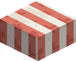{ .block-icon } **Awning Cloth** | The striped cloth over the market stalls: a slab, laid on posts. No creature spawns on it. | Red Wool, White Wool, Red Wool in a row → 6 | — |
| 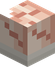{ .block-icon } **Conch Lantern** | The village light. It **stands on a block or hangs under one**, and gives a little less light than a lantern (12 instead of 15). | 8 Cut Cloud around 1 Torch → 1 | — |
| 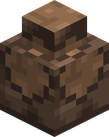{ .block-icon } **Vearth Urn** | A pot of Vearth, the earth Skypieans treasure: a decoration set by the doors. | 3 Brick (the item) in a V, 1 Dirt between the top two → 1 | — |

A recipe viewer (JEI or EMI) shows the same recipes in game.

!!! note "The Knock-Up Core"
    The base of a [Knock-Up Stream](getting-there.md) holds one more block, the **Knock-Up Core**: invisible, unbreakable, and never an item. It is the geyser's machinery, placed by the world itself.
