# Blocks

Sky Island adds the clouds Skypiea is made of, the blocks its villages are built from — shell tiles, shutters, doors and awnings in four colours — and a few more: the weather cloud, the milky cloud of the roads, gilded stone bricks. Every village block can be crafted, so a Skypiean house can be built anywhere.

Turn a block round (drag), zoom (scroll or pinch), and pick another with the buttons:

## The clouds

| Block | What it is | How to get it |
|---|---|---|
| { .block-icon } **Island Cloud** | The cloud you walk on: the ground of the [Angel Islands](angel-islands.md) and the surface of the cloud sea. Soft, quick to break, with the sound of wool. | Dig it in Skypiea. |
| { .block-icon } **Sea Cloud** | The body of the cloud sea. You do not stand on it: you **swim in it**, and falling into it does no harm. It is not water, so it does not weaken a Devil Fruit user. | Take it with an **empty bucket**. Broken by hand, it drops nothing. |
| { .block-icon } **Cloud Farmland** | Island cloud tilled with a **hoe**. Crops grow in it exactly as in farmland: water nearby keeps it moist, and trampled or left bare it turns back into island cloud. | Use a hoe on island cloud. Broken, it gives island cloud back. |

### The Sea Cloud Bucket

{ .block-icon } An **empty bucket** used on a block of sea cloud takes it, as it takes powder snow; the **Sea Cloud Bucket** lays it back where you use it. One block a bucket: the cloud sea does not flow, so a bucket never makes a spring. A dispenser does both too. **Sea cloud waters cloud farmland**, so this is how the sea comes to a field.

## The village blocks

Everything starts from **Island Cloud**. A **stonecutter** makes each block one for one; the crafting grid makes several at a time.

| Block | What it is | Crafting grid | Stonecutter |
|---|---|---|---|
| { .block-icon } **Cloud Brick** | The village walls: packed cloud sawn into bricks, harder than island cloud. | 4 Island Cloud in a square → 4 | Island Cloud |
| { .block-icon } **Cut Cloud** | The smooth panel: lintels, frames, plinths and paving. | 4 Cloud Brick in a square → 4 | Island Cloud or Cloud Brick |
| { .block-icon } **Cut Cloud Slab** | The half block of cut cloud. | 3 Cut Cloud in a row → 6 | Cut Cloud |
| { .block-icon } **Cloud Pillar** | The column: it can stand or lie along any axis, like a log. | 2 Cut Cloud, one on the other → 2 | Cut Cloud |
| { .block-icon } **Cloud Pillar Wall** | The slender column: a wall that joins its neighbours and stacks into a thin post. | 6 Cloud Pillar, in two rows of three → 6 | Cloud Pillar |
| { .block-icon } **Shell Tile** | The roofs: scales of shell, the hardest block of the village. | 8 Cut Cloud around 1 Cyan Dye → 8 | — |
| { .block-icon } **Shell Tile Stairs** | The slope of the roofs. | 6 Shell Tile in a staircase → 4 | Shell Tile |
| { .block-icon } **Cloud Glass** | The windows: milky and barely see-through, but daylight passes. | Smelt Island Cloud in a furnace | — |
| { .block-icon } **Awning Cloth** | The striped cloth over the market stalls: a slab, laid on posts. No creature spawns on it. | Red Wool, White Wool, Red Wool in a row → 6 | — |
| { .block-icon } **Conch Lantern** | The village light. It **stands on a block or hangs under one**, and gives a little less light than a lantern (12 instead of 15). | 8 Cut Cloud around 1 Torch → 1 | — |
| { .block-icon } **Vearth Urn** | A pot of Vearth, the earth Skypieans treasure: a decoration set by the doors. | 3 Brick (the item) in a V, 1 Dirt between the top two → 1 | — |

### The other colours

A roof is turquoise, coral, amber or lilac, and the shutters, the door and the awning are painted to match. The turquoise shell tile and the red awning are the two above.

| Block | What it is | Crafting grid | Stonecutter |
|---|---|---|---|
| 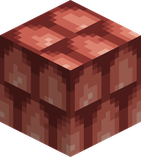{ .block-icon } **Coral Shell Tile** | The roofs' other colours. | 8 Cut Cloud around 1 Red Dye → 8 | — |
| 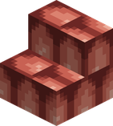{ .block-icon } **Coral Shell Tile Stairs** | Its slope. | 6 Coral Shell Tile in a staircase → 4 | Coral Shell Tile |
| 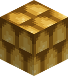{ .block-icon } **Amber Shell Tile** | The roofs' other colours. | 8 Cut Cloud around 1 Yellow Dye → 8 | — |
| 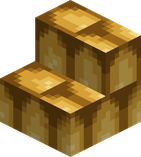{ .block-icon } **Amber Shell Tile Stairs** | Its slope. | 6 Amber Shell Tile in a staircase → 4 | Amber Shell Tile |
| 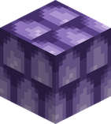{ .block-icon } **Lilac Shell Tile** | The roofs' other colours. | 8 Cut Cloud around 1 Purple Dye → 8 | — |
| 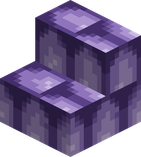{ .block-icon } **Lilac Shell Tile Stairs** | Its slope. | 6 Lilac Shell Tile in a staircase → 4 | Lilac Shell Tile |
| 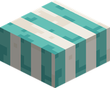{ .block-icon } **Turquoise Awning Cloth** | The awning, striped in another colour. | Cyan Wool, White Wool, Cyan Wool in a row → 6 | — |
| 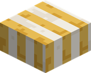{ .block-icon } **Amber Awning Cloth** | The awning, striped in another colour. | Yellow Wool, White Wool, Yellow Wool in a row → 6 | — |
| 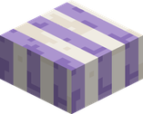{ .block-icon } **Lilac Awning Cloth** | The awning, striped in another colour. | Purple Wool, White Wool, Purple Wool in a row → 6 | — |

**Shutters and doors**, in the four paints. They are wooden to the game: a hand opens them, and so do the villagers.

| Shutter | Door | Recipe |
|---|---|---|
| { .block-icon } **Turquoise Shutter** | { .block-icon } **Turquoise Door** | any wooden trapdoor, or any wooden door, with 1 Cyan Dye |
| { .block-icon } **Coral Shutter** | 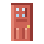{ .block-icon } **Coral Door** | any wooden trapdoor, or any wooden door, with 1 Red Dye |
| { .block-icon } **Amber Shutter** | 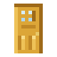{ .block-icon } **Amber Door** | any wooden trapdoor, or any wooden door, with 1 Yellow Dye |
| { .block-icon } **Lilac Shutter** | { .block-icon } **Lilac Door** | any wooden trapdoor, or any wooden door, with 1 Purple Dye |

## More blocks

| Block | What it is | How to get it |
|---|---|---|
| 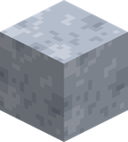{ .block-icon } **Weather Cloud** | A cloud with a weather of its own: it drizzles, snows or blows a breeze. Click it with a **snowball**, a **feather** or a **bucket of water** to change its weather. Seen all over [Weatheria](weatheria.md). | 2 Cut Cloud and a Water Bucket → 2 |
| 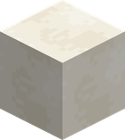{ .block-icon } **Milky Cloud** | The deck of the [Milky Roads](getting-around.md#the-milky-roads): creamy white, and it glows a little. | Dig it on a road, with a shovel. |
| 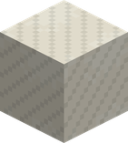{ .block-icon } **Milky Curb** | The roads' edges: milky cloud a shade darker, ribbed. | Dig it on a road. |
| 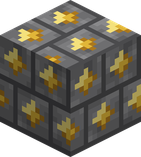{ .block-icon } **Gilded Stone Bricks** | Stone bricks inlaid with gold leaf: the walls of [Shandora](upper-yards.md#shandora-the-city-of-gold). | 4 Stone Bricks around 1 Gold Nugget → 4 |

A recipe viewer (JEI or EMI) shows the same recipes in game.

!!! note "The Knock-Up Core"
    The base of a [Knock-Up Stream](getting-there.md) holds one more block, the **Knock-Up Core**: invisible, unbreakable, and never an item. It is the geyser's machinery, placed by the world itself. Server builders have a geyser they can place, the **Knock-Up Stream block**: see [Configuration](configuration.md#for-server-builders).
