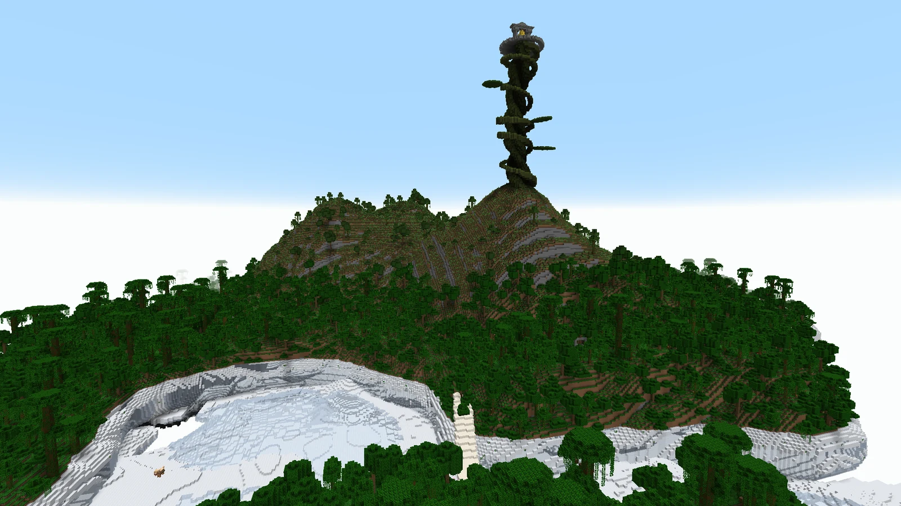
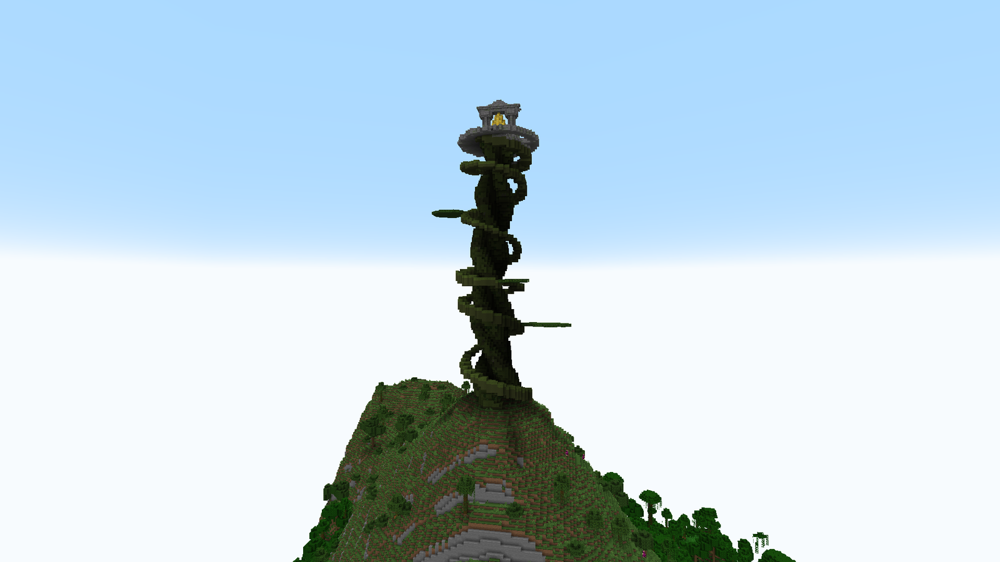
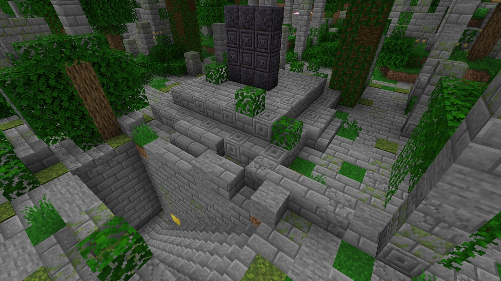
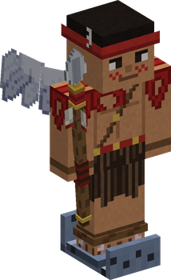
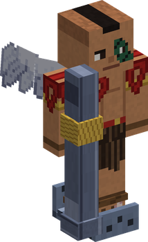
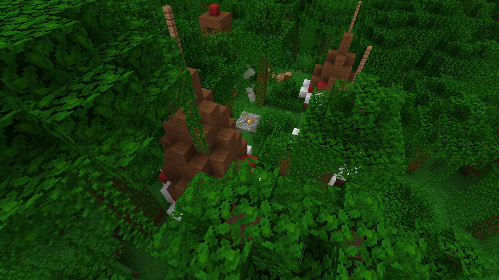

# Upper Yards

<figure class="place" markdown>
{ target="_blank" title="Open the picture full size" }
<figcaption>An Upper Yard: jungle, a massif, and the Giant Jack.</figcaption>
</figure>

One island in three is an **Upper Yard**: rarer and far larger than an Angel Island, made of the Blue Sea's earth — the **Vearth** the Skypieans revere. Jungle **plains** around y 100, and **massifs** of rock rising to about 215.

## The Giant Jack

<figure class="place" markdown>
{ target="_blank" title="Open the picture full size" }
<figcaption>The Giant Jack, and the Golden Bell at its top.</figcaption>
</figure>

One Upper Yard in three has the **Giant Jack**: a beanstalk that towers over the island from its highest massif, **climbable all the way up** by a ramp around it. At the top hangs the **Golden Bell**, with a chest beneath it — **one or two boxes**, a **Golden Box** in about two chests in five.

## Shandora, the City of Gold

<figure class="place" markdown>
{ target="_blank" title="Open the picture full size" }
<figcaption>Shandora's square: the Poneglyph, over the crypt.</figcaption>
</figure>

A little over half of the Upper Yards hold the ruins of **Shandora**, sometimes beside a Giant Jack (never within reach of its stalk): a square, avenues, halls, a broken tower, the stepped temple with its altar, and under the square **the crypt beneath the Poneglyph**.

| Where | What it may hold |
|---|---|
| The halls | gold, common dials, extols; a box in about one chest in seven |
| The temple's altar | gold, diamonds, emeralds, rare dials; a box in six chests in ten |
| **The crypt** | **the treasure**: gold, diamonds, netherite, very rare items, a heavy extol pouch — **one box** a chest, golden four times in ten |

A whole city gives about four boxes, one of them golden. The walls are inlaid with **gilded stone bricks**; the gold itself is in the crypt.

**Small ruins of Shandora** lie in the jungle too, one to three per Upper Yard: a forgotten altar, a colonnade, a fallen house, a sacred well.

## The Shandias

The warriors of Shandora, and their chief, guarding their land. **They attack only looters**: leave their chests shut and they leave you alone.

<figure markdown>

<figcaption>A warrior with his spear (one of six looks)</figcaption>
</figure>

<figure markdown>

<figcaption>The chief with the burn bazooka</figcaption>
</figure>

In 3D: drag to turn, scroll or pinch to zoom; the buttons change the look. The warrior is shown with the spear, the commonest of his six weapons.

- Their skills, from dials: the burn bazooka, impact, a breath dash, a sky step, and the chief's reject.
- Their arrows and bullets pass through other Shandias: they never hit their own.

A warrior carries **one of six weapons**; the chief keeps the bazooka.

| Weapon | How it fights |
|---|---|
| **Shandia spear** (the commonest) | hand to hand, with an impact dial |
| **Shandia bow** | keeps its distance (16 blocks); flame arrows, volleys |
| **Twin pistols** | keeps its distance (10 blocks), two bullets at a time; sidesteps |
| **Rifle** | from far away (24 blocks): **aims for a second and a half** — you see its line of sight — then fires a precise shot |
| **Shandia shield** and spear | guards its front and walks ahead of the others; bashes with the shield, and can send projectiles back |
| **Burn bazooka** | the burn bazooka's blast |

Warriors never drop their weapons. Four of them are items of this mod: see [their weapons in your hands](#the-shandias-weapons-in-your-hands).
- Few of them at a time: a chief and a warrior on Shandora's square, one in the temple, one in the tower.

## The Shandias' weapons in your hands

The spear and the bazooka have a 3D model of their own: turn them (drag), zoom (scroll or pinch), and change with the buttons.

| Weapon | In a player's hands | Where it comes from |
|---|---|---|
| **Shandia Spear** | A real weapon: it hits like an iron sword (6 attack damage) but a little slower, lasts as long (250 uses), and takes a sword's enchantments. An anvil mends it with iron ingots. | The chests of the [Shandia camps](#shandia-camps): about one chest in three holds one. |
| **Burn Bazooka** | A trophy: the jet of fire is the Shandias' own skill, and the item does nothing when used. One per slot. | The same chests, rarely: about one in twelve. |
| { .item-icon }**Shandia Bow** | A bow like any other: draw it and shoot arrows. 384 uses. | Not found in survival in this version: the creative tab only. The camp chests hold an ordinary bow now and then. |
| **Shandia Shield** | A shield like any other, in the Shandias' red, gold and black: raise it to block, and an axe disables it. 336 uses. | Not found in survival in this version: the creative tab only. |

## Shandia camps

<figure class="place" markdown>
{ target="_blank" title="Open the picture full size" }
<figcaption>A war camp: tipis round a fire.</figcaption>
</figure>

**War camps**: two to four per Upper Yard wherever it has the clearings, in clearings of the plains, away from the city, the Giant Jack and the ruins. Four tipis round a fire, a totem, a weapon rack and a lookout, with two warriors.

**The hidden village**: the Shandias' own village, in a **pocket of cloud on the sea at the island's foot**, its only opening facing the sea. Six tipis round a square, the **statue of Kalgara**, totems along the path, and the chief by the fire.

There is **a chest in every tipi**: weapons, war dials, gold and emeralds, an extol pouch, food and arrows — and now and then a Wooden or an Iron Box.

## Predators

The Upper Yards are hunting ground for three beasts: the **Cloud Wolf**, the **Sky Shark** and the **Sky Lamprey**. They are on the [Wildlife](wildlife.md#the-predators-of-the-upper-yards) page.
