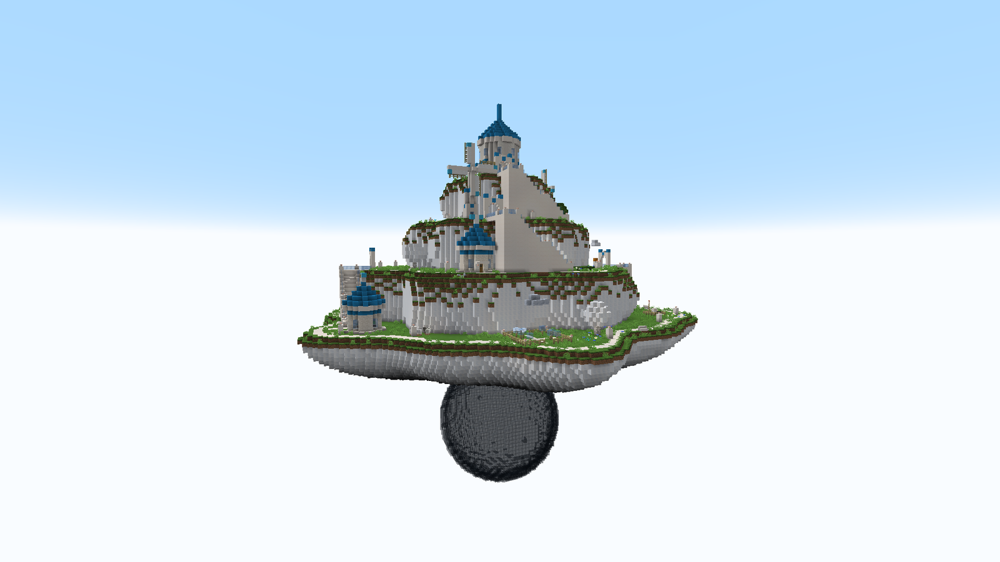
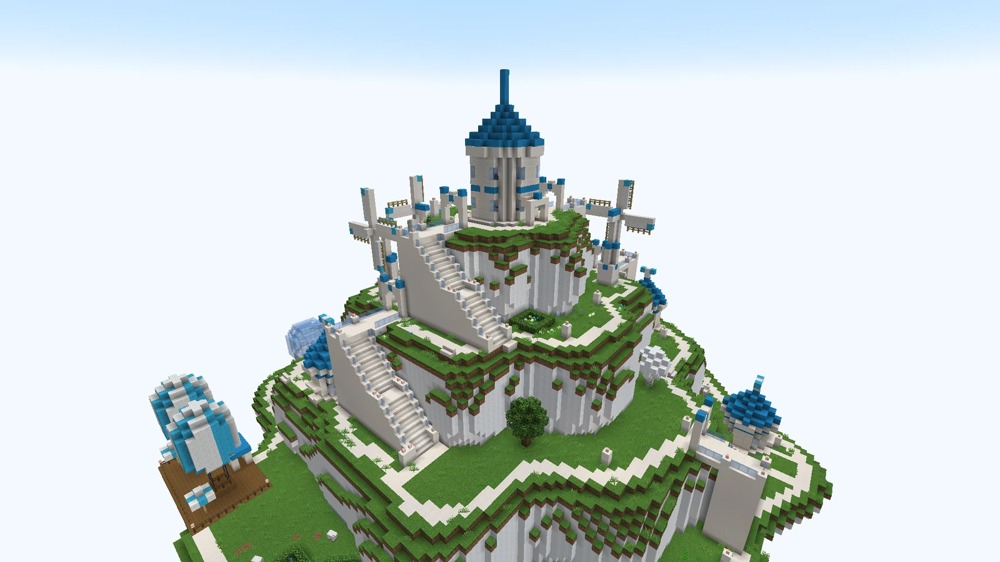

# Weatheria

<figure class="place" markdown>
{ target="_blank" title="Open the picture full size" }
<figcaption>Weatheria, on its glass bubble.</figcaption>
</figure>

The weather scientists' island. Unlike an Angel Island or an Upper Yard, it does not rise out of the cloud sea: it **floats**, a cake of **four tiers of cloud**, green on top, resting on a great **glass bubble**.

- **Rare**: about one Weatheria for ten islands.
- **Over land as well as over the sea**: it drifts where it likes, never above an island.
- **No Knock-Up Stream leads to it.** Fly there on a [Sky Dot Bird or a Three-Jo Bird](wildlife.md#the-flying-mounts); a [Milky Road](getting-around.md#the-milky-roads) never crosses it.

## The scientists' town

<figure class="place" markdown>
{ target="_blank" title="Open the picture full size" }
<figcaption>The scientists' town, and Haredas's tower at the summit.</figcaption>
</figure>

| Where | What stands there |
|---|---|
| The summit | **Haredas's tower**: the control room with its instruments and a chest, his study upstairs |
| The tiers | pinwheel **windmills**, the scientists' **houses**, the **observatory** and its glass sphere, the **Weather Ball garden** |
| The rim | the **balloon terminal**, where the weather is sold |

**White stairs** with glass railings and lantern posts join the tiers, two for each. White **promenades** run along every rim, with lamp posts and benches facing the view, and straight paths lead to every door.

Between the buildings: trimmed trees and **cloud trees**, blue and white flower beds, a **snowy corner** with its snowman under a snow cloud, a sunny corner of sunflowers, a **weather station**, and a line of Wind Knots near the tower. Cloud foxes and sheep live on the island.

**Chests** in the control room, the houses and the garden hold a Devil Fruit box now and then; the control room is the most generous.

## Its people

- **Haredas**, the master of the **Art of Weather**: a long blue robe, a great white beard, a tall hat whose tip flops over, and a Birkan's small wings pointing down. He teaches the base mod's Art of Weather, and keeps to his tower. He also lives on the **climate terrace** of one Skypiean village in three.
- **The Weatheria Scientists**: old men in wizard robes and pointed hats, in **twelve looks**. Two in each house, one at the observatory and one in the garden. They never fight: they **flee when struck**, and keep to their homes.
- **The Weather Vendor**, at the balloon terminal's booth.

## Weather for sale

Talk to the **Weather Vendor** to open his booth. He sells the weather of **the Blue Sea below** — the overworld, not Skypiea, where it never rains:

| Weather | Price | Lasts |
|---|---|---|
| Clear sky | 1,000,000 extol | 15 minutes |
| Rain | 1,500,000 extol | 10 minutes |
| Thunderstorm | 3,000,000 extol | 5 minutes |

**One sale a day at each booth**: the screen shows how long the booth still rests.

## The weather cloud

A block of cloud with a weather of its own, seen all over Weatheria: a drizzle over the garden, snow over the snowy corner, a breeze out of every windmill.

- **Recipe**: two Cut Cloud and a bucket of water give two weather clouds, drizzling.
- **Change its weather by hand**: a **snowball** makes it snow, a **feather** makes it blow, a **bucket of water** brings the drizzle back. The snowball and the feather are used up; the bucket keeps its water.
