# Wildlife

Skypiea's animals, after the manga: two birds you can ride, a living compass, and two companions. All of them come down on solid ground in the light, never on leaves; nothing spawns on the beach or the cloud sea, and **no monster spawns anywhere in Skypiea**.

| Animal | Where | Tamed with | What it is |
|---|---|---|---|
| **South Bird** | Upper Yards, commonest | — | a living compass |
| **Sky Dot Bird** | Angel Islands and Upper Yards, rare | seeds | a light flying mount |
| **Three-Jo Bird** | Upper Yards only, rarer | seeds | a great flying mount |
| **Cloud Fox** | Angel Islands | fish | a companion |
| **Giant Dog** | Upper Yards only, very rare | raw meat | a guard and a mount |

All five have spawn eggs in the **Skypiea** creative tab.

## The South Bird

The bird of Jaya, grown **huge** on Skypiea (about two blocks tall), and friendly. It perches and takes to the air now and then. **A living compass**: whenever it stops, it swings round to face **south**, beak and all — a way to find your bearings on a sea of clouds.

<figure markdown>
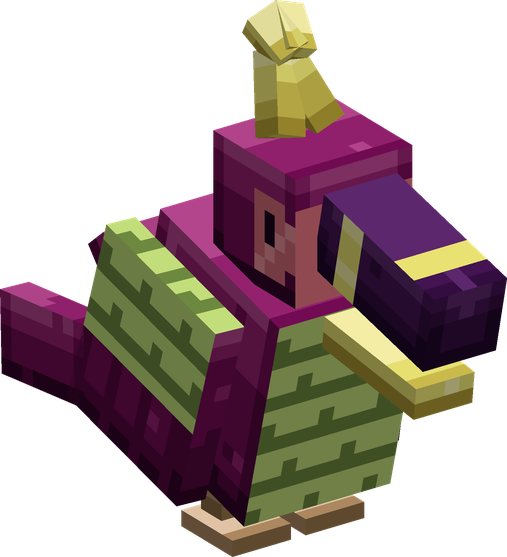
<figcaption>The South Bird</figcaption>
</figure>

## The flying mounts

**The Sky Dot Bird** (Pierre's kind) is pink and dotted, quick and a strong climber. **The Three-Jo Bird** (Fuza's kind) is a great lilac vulture with a salmon ruff: bigger and tougher, slower to climb.

<figure markdown>
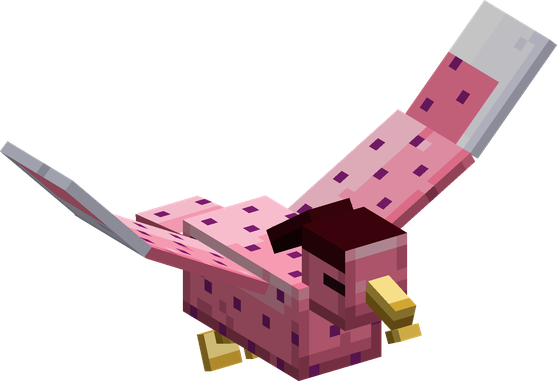
<figcaption>The Sky Dot Bird</figcaption>
</figure>

<figure markdown>
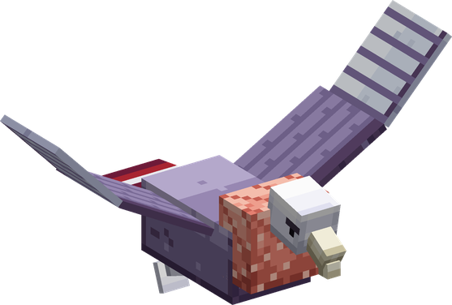
<figcaption>The Three-Jo Bird</figcaption>
</figure>

| | Sky Dot Bird | Three-Jo Bird |
|---|---|---|
| Health | 30 | 50 |
| Taming | one seed in 5 | one seed in 10 |
| Wingspan | about 4.5 blocks | about 6.5 blocks |

1. **Tame** it with seeds (wheat, melon, pumpkin, beetroot or torchflower), like a parrot. Seeds also heal a tamed one.
2. **Saddle** it: use a **vanilla saddle** on it. Without a saddle, a click makes it sit or stand.
3. **Ride** it: use it with an empty hand. **Only its owner** can ride and steer it.

<figure markdown>
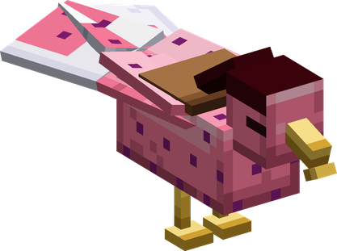
<figcaption>Sky Dot Bird, with a saddle</figcaption>
</figure>

<figure markdown>
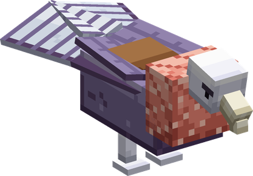
<figcaption>Three-Jo Bird, with a saddle</figcaption>
</figure>

**Flying it** — a horse that flies:

| Key | In the air |
|---|---|
| Movement keys | fly the way you look |
| **Jump** | climb |
| **Sneak** | descend |
| neither | hover where you are |

!!! note "Getting off"
    In the air, **Sneak descends and never drops you off**. Land, then Sneak to get down. Holding Sneak all the way to the ground gets you off as soon as it touches down.

**Below the cloud sea**, the bird and its rider fall back to the overworld **together**, the rider still in the saddle. A mount takes no fall damage.

## The Cloud Fox

Su's kind: a small white fox with a long muzzle, on the Angel Islands. **Tame it with fish** (raw cod or salmon); it follows you, and **lies down on the cloud** when you click it. It never fights. 12 health.

<figure markdown>
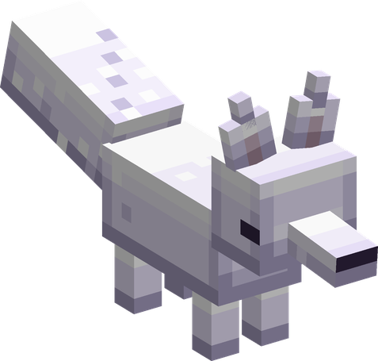
<figcaption>The Cloud Fox</figcaption>
</figure>

## The Giant Dog

Holy's kind: a **huge** dog — over three blocks tall — very rare in the Upper Yards. **Tame it with raw meat** (beef, pork or mutton).

<figure markdown>
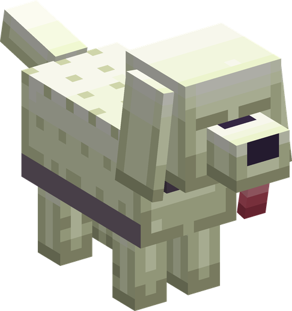
<figcaption>The Giant Dog</figcaption>
</figure>

<figure markdown>
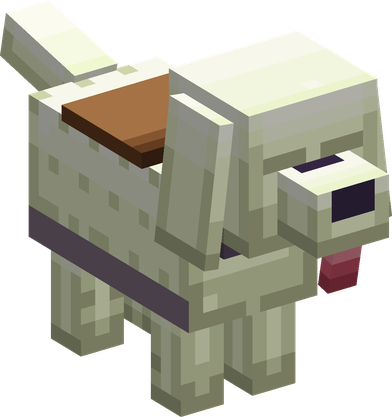
<figcaption>With a saddle</figcaption>
</figure>

- **A guard**, like a wolf: it goes for whatever strikes you and whatever you strike — never creepers, ghasts or your other animals. It catches up with you by leaping to your side when it gets stuck in the trees.
- **A mount**: put a **vanilla saddle** on it and ride it like a horse. The movement keys go the way you look; **Jump leaps** about three blocks. Ridden, it bites nothing of its own accord. **Sneak** + click still makes it sit or stand.
- **Tough**: 80 health, 8 attack damage, hard to knock back, and **no fall damage under ten blocks** (half beyond).

## Coats

The fox and the dog are born in one of **five coats** and keep it for life; the first is the manga's own.

| | Coats |
|---|---|
| Cloud Fox | **cloud** (Su), sky, dawn, mint, dusk |
| Giant Dog | **cream** (Holy), russet, silver, chocolate, charcoal |

<figure markdown>
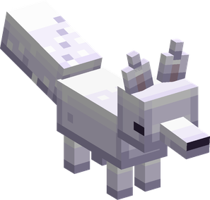
<figcaption>cloud</figcaption>
</figure>

<figure markdown>
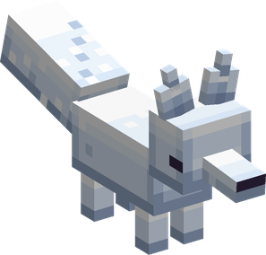
<figcaption>sky</figcaption>
</figure>

<figure markdown>
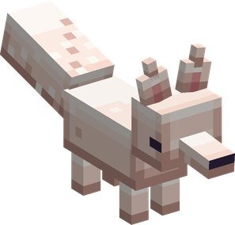
<figcaption>dawn</figcaption>
</figure>

<figure markdown>
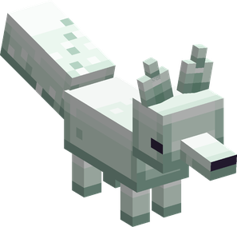
<figcaption>mint</figcaption>
</figure>

<figure markdown>
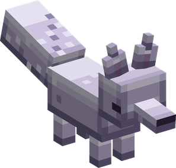
<figcaption>dusk</figcaption>
</figure>

<figure markdown>

<figcaption>cream</figcaption>
</figure>

<figure markdown>
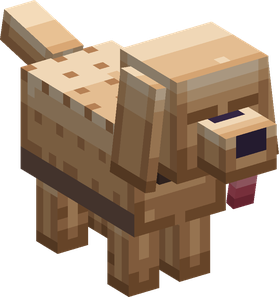
<figcaption>russet</figcaption>
</figure>

<figure markdown>
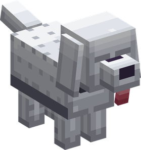
<figcaption>silver</figcaption>
</figure>

<figure markdown>
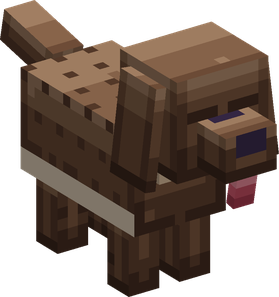
<figcaption>chocolate</figcaption>
</figure>

<figure markdown>
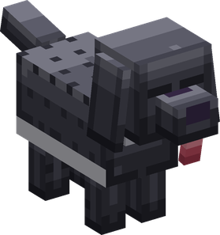
<figcaption>charcoal</figcaption>
</figure>

## Drops

The birds drop **feathers** and **meat** (cooked if they burned), more with Looting: one to three feathers and one or two pieces of meat from the South Bird and the Sky Dot Bird, two to five and two or three from the Three-Jo Bird. A saddled mount drops its saddle.
