# Wildlife

Skypiea's animals, after the manga: two birds you can ride, a living compass, two companions, the fish of the cloud sea, and the three predators of the Upper Yards. **No vanilla monster spawns anywhere in Skypiea.**

| Animal | Where | Tamed with | What it is |
|---|---|---|---|
| **South Bird** | Upper Yards, commonest | — | a living compass |
| **Sky Dot Bird** | Angel Islands and Upper Yards, rare | seeds | a light flying mount |
| **Three-Jo Bird** | Upper Yards only, rarer | seeds | a great flying mount |
| **Cloud Fox** | Angel Islands | fish | a companion |
| **Giant Dog** | Upper Yards only, very rare | raw meat | a guard and a mount |

| **Sky Fish**, **Balloon Sky Fish**, **Giant Sky Fish** | the cloud sea | — | [the fish of the sea](#the-cloud-sea) |
| **Sky Lobster** | Angel Beaches | — | a lobster on the beach |
| **Cloud Wolf** | Upper Yards only | cooked meat | [a predator](#the-predators-of-the-upper-yards), and a companion once tamed |
| **Sky Shark** | Upper Yards only | — | a predator of the air |
| **Sky Lamprey** | Upper Yards only, rare | — | a giant ambusher |

All of them have spawn eggs in the **Skypiea** creative tab.

## In 3D

Drag to turn an animal round, scroll (or pinch) to zoom. The buttons under it show its coats, its saddle, and the birds on the ground.

## The South Bird

The bird of Jaya, grown **huge** on Skypiea (about two blocks tall), and friendly. It perches and takes to the air now and then. **A living compass**: whenever it stops, it swings round to face **south**, beak and all — a way to find your bearings on a sea of clouds.

<figure markdown>
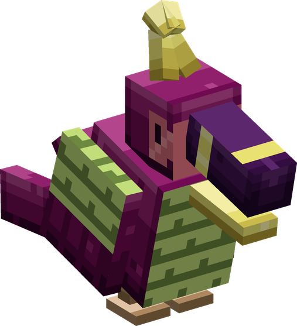
<figcaption>The South Bird</figcaption>
</figure>

## The flying mounts

**The Sky Dot Bird** (Pierre's kind) is pink and dotted, quick and a strong climber. **The Three-Jo Bird** (Fuza's kind) is a great lilac vulture with a salmon ruff: bigger and tougher, slower to climb.

<figure markdown>
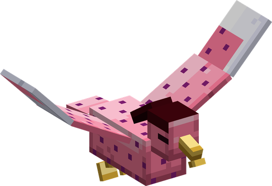
<figcaption>The Sky Dot Bird</figcaption>
</figure>

<figure markdown>
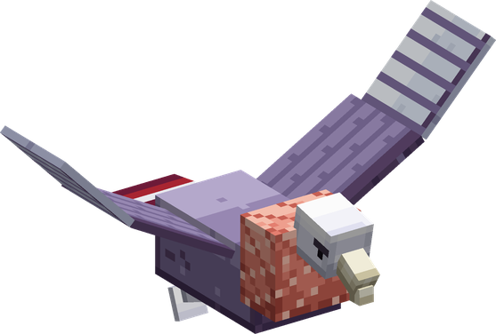
<figcaption>The Three-Jo Bird</figcaption>
</figure>

| | Sky Dot Bird | Three-Jo Bird |
|---|---|---|
| Health | 30 | 50 |
| Taming | one seed in 5 | one seed in 10 |
| Wingspan | about 4.5 blocks | about 6.5 blocks |

1. **Tame** it with seeds (wheat, melon, pumpkin, beetroot or torchflower), like a parrot. Seeds also heal a tamed one.
2. **Saddle** it: use a **vanilla saddle** on it. Without a saddle, a click makes it sit or stand.
3. **Ride** it: use it with an empty hand. **Only its owner** can ride and steer it.

<figure markdown>
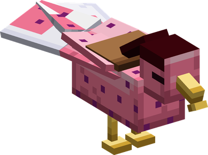
<figcaption>Sky Dot Bird, with a saddle</figcaption>
</figure>

<figure markdown>
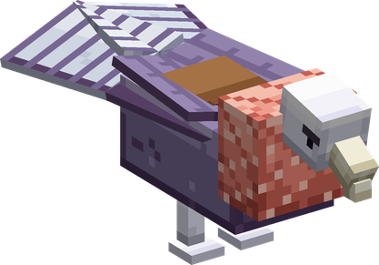
<figcaption>Three-Jo Bird, with a saddle</figcaption>
</figure>

**Flying it** — a horse that flies:

| Key | In the air |
|---|---|
| Movement keys | fly the way you look |
| **Jump** | climb |
| **Sneak** | descend |
| neither | hover where you are |

!!! note "Getting off"
    In the air, **Sneak descends and never drops you off**. Land, then Sneak to get down. Holding Sneak all the way to the ground gets you off as soon as it touches down.

**Below the cloud sea**, the bird and its rider fall back to the overworld **together**, the rider still in the saddle. A mount takes no fall damage.

## The Cloud Fox

Su's kind: a small white fox with a long muzzle, on the Angel Islands. **Tame it with fish** (raw cod or salmon); it follows you, and **lies down on the cloud** when you click it. It never fights. 12 health.

<figure markdown>
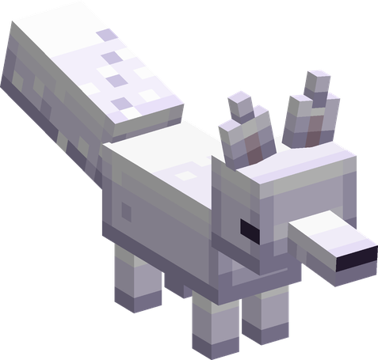
<figcaption>The Cloud Fox</figcaption>
</figure>

## The Giant Dog

Holy's kind: a **huge** dog — over three blocks tall — very rare in the Upper Yards. **Tame it with raw meat** (beef, pork or mutton).

<figure markdown>
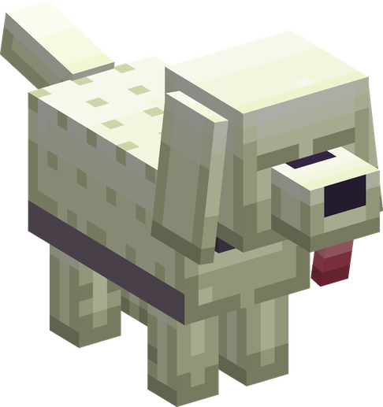
<figcaption>The Giant Dog</figcaption>
</figure>

<figure markdown>
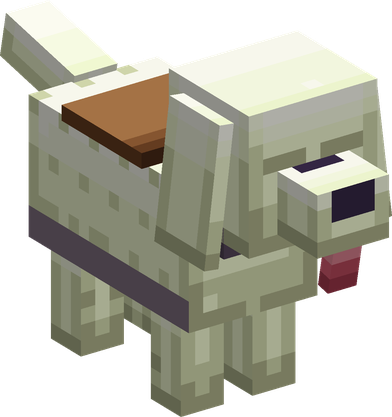
<figcaption>With a saddle</figcaption>
</figure>

- **A guard**, like a wolf: it goes for whatever strikes you and whatever you strike — never creepers, ghasts or your other animals. It catches up with you by leaping to your side when it gets stuck in the trees.
- **A mount**: put a **vanilla saddle** on it and ride it like a horse. The movement keys go the way you look; **Jump leaps** about three blocks. Ridden, it bites nothing of its own accord. **Sneak** + click still makes it sit or stand.
- **Tough**: 80 health, 8 attack damage, hard to knock back, and **no fall damage under ten blocks** (half beyond).

## Coats

The fox and the dog are born in one of **five coats** and keep it for life; the first is the manga's own.

| | Coats |
|---|---|
| Cloud Fox | **cloud** (Su), sky, dawn, mint, dusk |
| Giant Dog | **cream** (Holy), russet, silver, chocolate, charcoal |

<figure markdown>
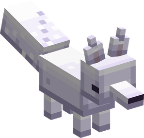
<figcaption>cloud</figcaption>
</figure>

<figure markdown>
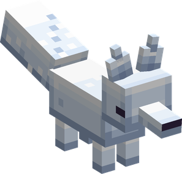
<figcaption>sky</figcaption>
</figure>

<figure markdown>
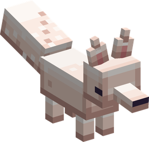
<figcaption>dawn</figcaption>
</figure>

<figure markdown>
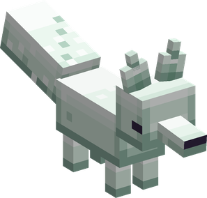
<figcaption>mint</figcaption>
</figure>

<figure markdown>
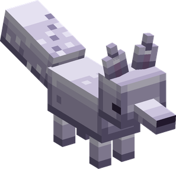
<figcaption>dusk</figcaption>
</figure>

<figure markdown>

<figcaption>cream</figcaption>
</figure>

<figure markdown>
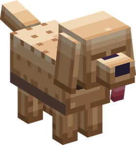
<figcaption>russet</figcaption>
</figure>

<figure markdown>
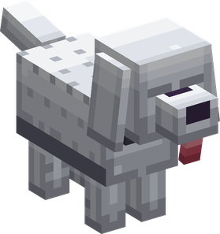
<figcaption>silver</figcaption>
</figure>

<figure markdown>
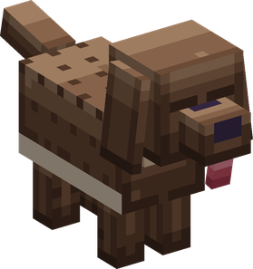
<figcaption>chocolate</figcaption>
</figure>

<figure markdown>
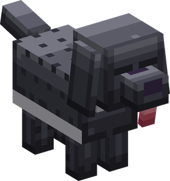
<figcaption>charcoal</figcaption>
</figure>

## The cloud sea

The sea is translucent: its fish are seen from above, swimming close under the surface.

| Creature | Where | How it shows itself | Drops |
|---|---|---|---|
| **Sky Fish** | the cloud sea, in shoals of two to four | leaps out of the sea | a cod |
| **Balloon Sky Fish** | the cloud sea, rare | floats with its back out of the sea | a pufferfish |
| **Giant Sky Fish** | the cloud sea, far apart | its fan cuts the surface, and it breaches now and then | four to six cod |
| **Sky Lobster** | the Angel Beaches | walks the beach | a salmon |

<figure markdown>
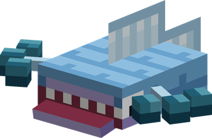
<figcaption>The Sky Fish</figcaption>
</figure>

<figure markdown>
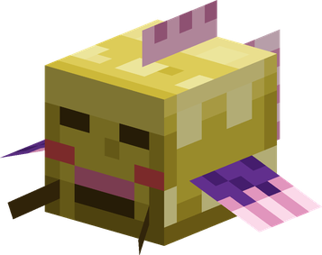
<figcaption>The Balloon Sky Fish</figcaption>
</figure>

<figure markdown>
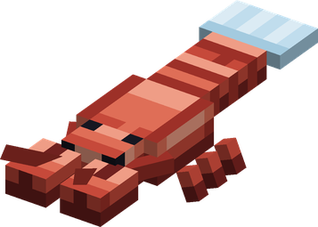
<figcaption>The Sky Lobster</figcaption>
</figure>

None of them fights. They are not vanilla fish: the cloud sea is not water, and a vanilla fish would suffocate in it.

**Fishing**: a fishing rod works in the cloud sea — the bobber floats and fish bite. What you catch is the game's own fishing loot, unless another mod changes it.

## The predators of the Upper Yards

Three beasts hunt in the [Upper Yards](upper-yards.md), and nowhere else. They are there with the land, like the birds, and attack nobody in Peaceful.

| Predator | How many | Health | Attack | What it does |
|---|---|---|---|---|
| **Cloud Wolf** | packs of two or three | 30 | 4 | hunts on sight; can be tamed |
| **Sky Shark** | twos and threes, rarer | 24 | 5 | swims the air; goes for the wounded |
| **Sky Lamprey** | alone, rare | 120 | 8 | lies in wait, bites and holds |

### The Cloud Wolf

A wolf that walks on two legs: lilac grey with a great white ruff and tail, narrow yellow eyes. Three coats: **lilac** (the manga's), **storm** and **snow**.

<figure markdown>
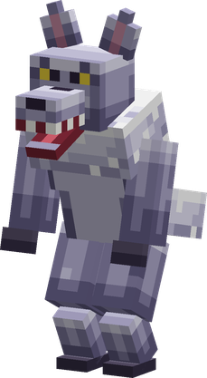
<figcaption>lilac</figcaption>
</figure>

<figure markdown>
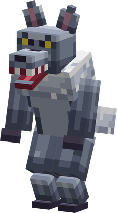
<figcaption>storm</figcaption>
</figure>

<figure markdown>
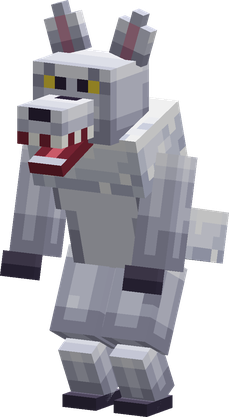
<figcaption>snow</figcaption>
</figure>

- **It hunts.** A wild wolf goes for any player it sees, and a wolf that is struck calls its pack.
- **It can be tamed** with **cooked meat** (beef, pork, mutton, chicken or rabbit): one try in three. A tamed wolf follows its owner, fights for them, sits when told, and no longer hunts players.
- Weaker than a Shandia, but faster: one is a nuisance, three are a fight. 2 armor.
- **Drops**: leather (none to two) and meat (one or two).

### The Sky Shark

A shark that **swims the air** a few blocks over the ground: long and thin, navy blue with pale tiger stripes.

<figure markdown>
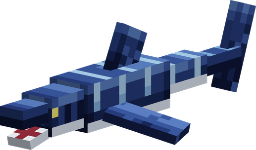
<figcaption>The Sky Shark</figcaption>
</figure>

- **It goes for blood.** A player it sees within 12 blocks is prey; a **wounded** one — three quarters of their health or less — draws it from 32 blocks, and it leaves a whole prey for a bleeding one.
- A wounded Sky Shark is prey to the others too.
- **Drops**: one or two cod.

### The Sky Lamprey

A giant: a pale tube as thick as a tree, four and a half blocks tall, with a round maroon mouth ringed with teeth.

<figure markdown>
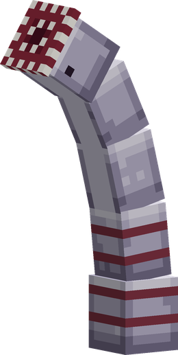
<figcaption>Risen</figcaption>
</figure>

<figure markdown>
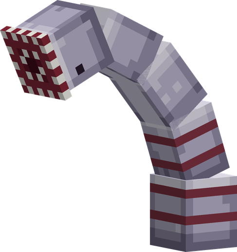
<figcaption>Striking</figcaption>
</figure>

- **It lies in wait**, sunk in the ground: only the ring of its teeth shows. It rises when a player comes within 7 blocks, and sinks back after ten seconds alone.
- **It bites and holds.** Within 4.5 blocks of its foot it bites, lifts its prey off the ground in its mouth and **holds it for three seconds**, biting twice more. The prey cannot climb out.
- **A blow frees the prey**: a hit of 4 damage or more on the lamprey — from the prey or from a friend — makes it let go at once. After a hold it rests five seconds.
- It never moves from its spot and cannot be pushed. 4 armor: as tough as a Shandia chief.
- **Drops**: three to five salmon.

## Drops

The birds drop **feathers** and **meat** (cooked if they burned), more with Looting: one to three feathers and one or two pieces of meat from the South Bird and the Sky Dot Bird, two to five and two or three from the Three-Jo Bird. A saddled mount drops its saddle.
